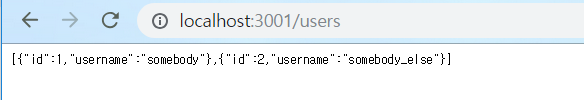
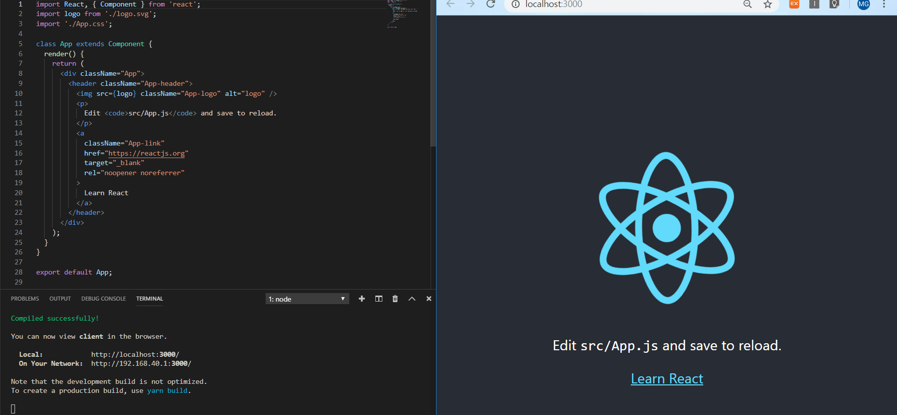
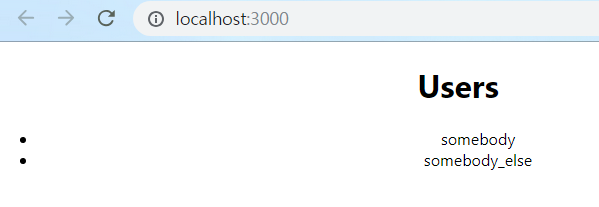

# 1. Create React App with and Express Backend

> React App과 Express 연동
>
> 이제 막 공부를 시작해서 Express 과 React 를 연동하는 법을 google에서 찾아 시도하였지만, 원하는 내용이 아니였다.  마침 유튜브에서 원하는 내용을 찾았기에 이를 적어보고자 한다.
>
>  [Create React App with and Express Backend](https://www.youtube.com/watch?v=8bNlffXEcC0)   

최종 만들어지는 디렉터리 트리는 다음과 같다.

```shell
:code
│  
├─client
│  │  .gitignore
│  │  package.json
│  │  README.md
│  │  yarn.lock
│  │              
│  ├─public
│  │      favicon.ico
│  │      index.html
│  │      manifest.json
│  │      
│  └─src
│          App.css
│          App.js
│          App.test.js
│          index.css
│          index.js
│          logo.svg
│          serviceWorker.js
│          
└─server
    │  app.js
    │  package-lock.json
    │  package.json
    │  
    ├─bin
    │      www
    │              
    ├─public
    │  ├─images
    │  ├─javascripts
    │  └─stylesheets
    │          style.css
    │          
    ├─routes
    │      index.js
    │      users.js
    │      
    └─views
            error.jade
            index.jade
            layout.jade
```


## 1 Back_end

 먼저 backend를 구성해보자!  나 같은 초보자는 프레임워크에 필요한 package.json을 만들어주고 기본 폴더 구조까지 잡아주는 패키지가 있다. 바로 Express-generator이다.

```shell
$ npm i express-generator
$ express server
```

위와 같이하면, server라는 프로젝트가 만들어진다.

```shell
$ cd server
$ npm install
```

server 폴더로 가서 필요한 모듈들을 설치해 준다. *package.json*에 필요한 모듈들이 적혀있기 때문에 쉽게 설치할 수 있다.

그렇게 되면 다음과 같이 directory tree를 볼 수 있다. 

```shell
:server
│  app.js
│  package-lock.json
│  package.json
│  
├─bin
│      www
│              
├─public
│  ├─images
│  ├─javascripts
│  └─stylesheets
│          style.css
│          
├─routes
│      index.js
│      users.js
│      
└─views
        error.pug
        index.pug
        layout.pug
```

해당 프로젝트를 실행시켜보자!

```shell
$ npm start
```

http://localhost:3000에서 작동이 잘 되는지 확인할 수 있다.

mac에서는 다음과 같은 명령인수를 넣어 포트를 변경하였다.

```shell
$ PORT=3001 npm start
```

윈도우에서는 다음과 같으 명령어를 쓰면 된다던데.. 나는 안됨 ㅠㅠㅠ

```shell
$ set PORT=3001 && node bin/www
```

그래서 결국 www 파일에서 코드를 바꾸기로 하였다.  

```javascript
//bin/www

.
.
.
var port = normalizePort(process.env.PORT || '3001');
app.set('port', port);
.
.
.
function onListening() {
  console.log("listening port: ",port);
  var addr = server.address();
  var bind = typeof addr === 'string'
    ? 'pipe ' + addr
    : 'port ' + addr.port;
  debug('Listening on ' + bind);
}
```

무슨 포트를 사용하고 있는지 알기 위하여  `onListening` 함수에 *'console.log()'*를 추가하였다.

3001번 port를 사용하는 이유는 front에서 3000번 포트를 사용할 것이기 때문에 포트를 겹치지 않게 하기 위해서이다.

연동되는지 확인을 위하여 test를 위하여 파일을 조금 수정하도록 하겠다.

```javascript
//routers/users.js

var express = require('express');
var router = express.Router();

/* GET users listing. */
router.get('/', function(req, res, next) {
  res.json([
    {id: 1, username: "somebody"},
    {id: 2, username: "somebody_else"}
  ]);
});

module.exports = router;

```

결과는 이렇게 나올 것이다.



이 값을 react App에 전송할 것이다.


## 2 Front_end

리엑트도 프로젝트를 일단 만들어 준다. client 폴더에 프로젝트를 만든다.

```shell
$ npm i -g create-react-app
$ create-react-app client
```

프로젝트명은 `client`.

다음으로 `package.json`에서 프록시(Proxy)키를 설정해 줘야한다. 이는 express와 react App이 서로 통신할 수 있는 역할을 할 것이다. 

> 프록시에 관한 설명은 다음을 참조하자. [프록시란?](https://ko.wikipedia.org/wiki/%ED%94%84%EB%A1%9D%EC%8B%9C_%EC%84%9C%EB%B2%84)
>
> 쉽게 말해서 중계 해주는 것이라고 생각하면 될 것 같다.

```json
//client/package.json

{
  "name": "client",
  "version": "0.1.0",
  "private": true,
  "dependencies": {
    "react": "^16.6.3",
    "react-dom": "^16.6.3",
    "react-scripts": "2.1.1"
  },
  "scripts": {
    "start": "react-scripts start",
    "build": "react-scripts build",
    "test": "react-scripts test",
    "eject": "react-scripts eject"
  },
  "eslintConfig": {
    "extends": "react-app"
  },
  "browserslist": [
    ">0.2%",
    "not dead",
    "not ie <= 11",
    "not op_mini all"
  ]{
  "name": "client",
  "version": "0.1.0",
  "private": true,
  "dependencies": {
    "react": "^16.6.3",
    "react-dom": "^16.6.3",
    "react-scripts": "2.1.1"
  },
  "scripts": {
    "start": "react-scripts start",
    "build": "react-scripts build",
    "test": "react-scripts test",
    "eject": "react-scripts eject"
  },
  "eslintConfig": {
    "extends": "react-app"
  },
  "browserslist": [
    ">0.2%",
    "not dead",
    "not ie <= 11",
    "not op_mini all"
  ],
  "proxy": "http://localhost:3001"
}
```

`"proxy": "http://localhost:3001"`를 추가한다.

이제 react 프로젝트가 제대로 실행되는지 확인해 보자!



굳! 굳! 지금까지는 순조롭다.

```javascript
//client/src/App.js

import React, { Component } from 'react';
import logo from './logo.svg';
import './App.css';

class App extends Component {
  state = { users: [] }

  componentDidMount(){
    fetch('/users')
    .then(res => res.json())
    .then(users => this.setState({ users }));
  }

  render() {
    return (
      <div className="App">
        <h1>Users</h1>
        <ul>
          {this.state.users.map(user =>
            <li key={user.id}> {user.username} </li>
          )}
        </ul>
      </div>
    );
  }
}

export default App;
```

App.js파일에서 코드를 수정한다. 

코드설명을 하자면

fetch('/users')코드로 인하여 react apps web back dev server가 package.json에 설정한 proxy를 통하여 request를 하게 되고, 값을 가지고 오게된다.

server를 실행시킨후 react app을 실행시키면 다음과 같은 화면을 볼수있다.



성공!!!

뿌듯하구먼