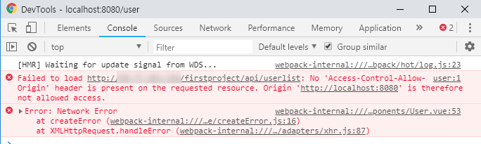
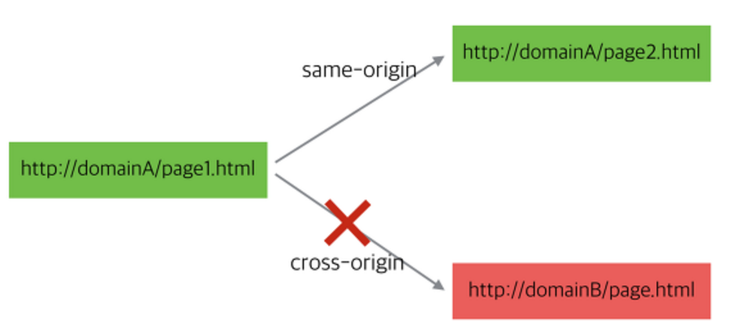
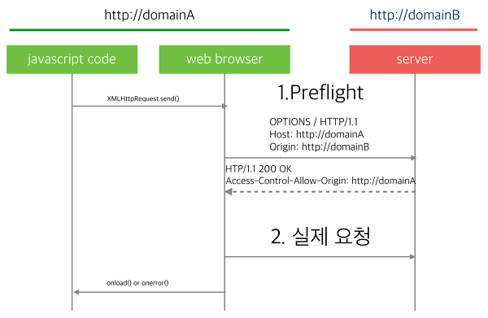

# 5.Using API in React

> 리액트에서 네이버 지역 API를 사용하는 방법을 정리하였습니다.
>
> 먼저 크로스 도메인 문제를 소개하고 이를 해결한 방법을 다룹니다.

## Overview

리액트에서 axios를 통하여 네이버 api를 사용하였다. 하지만 크로스 도메인 문제를 해결하기 위하여 6시간동안 고생을 하였다. ㅠㅠ 결국 node 서버를 돌렸다.

처음 작성한 코드는 다음과 같다.

```javascript
export async function getAPOD(data = '') {
  let tmpData = {'query': data}
  const options = {
    method: 'get',
    headers: {
      'X-Naver-Client-Id' : '{client id}',
      'X-Naver-Client-Secret' : '{client secret}',
    },
    url: 'https://openapi.naver.com/v1/search/local.json?query=pusan'
  }
  let response;
  await axios(options).then(res => {
      reponse = res.data;
  })
  return response;
}
```

그러면 다음과 같은 에러가 콘솔에 뜬다.



**크롬**

> No 'Access-Control-Allow-Origin' header is present on the requested resource. Origin '[요청한 도메인]' is  therefore not allowed access.

**파이어폭스**

> 교차 원본 요청 차안: 동일 출처 정책으로 인해 [요청한 도메인]에 있는 원격 자원을 읽을 수 없습니다. 자원을 같은 도메인으로 이동시키거나 CORS를 활성화하여 해결할 수 있습니다.

외부로 요청이 안 되는 것은 자바스크립트 엔진 표준 스펙에 동일 출처 정책(same-origin-policy)이라는 보안 규칙이 있기 때문이다.

### 정리

HTTP 요청은 기본적으로 Cross-Site HTTP Requests가 가능합니다. 다시 말하면, `` 태그로 다른 도메인의 이미지 파일을 가져오거나,  `<link>` 태그로 다른 도메인의 CSS를 가져오거나, `<script>` 태그로 다른 도메인의 JavaScript 라이브러리를 가져오는 것이 모두 가능합니다. 하지만 `<script></script>` 로 둘러싸여 있는 **스크립트**에서 생성된 Cross-Site HTTP Request는 **Same Origin Policy**를 적용 받기 때문에 Cross-Site Http Requests가 불가능 합니다. 즉, `protocol` , `host name` , `port` 가 같아야만 요청이 가능하다.

AJAX가 널리 사용되면서 `<script></script>` 로 둘러싸여 있는 스크립트에서 생성되는 `XMLHttpRequest` 에 대해서도 Cross-Site HTTP Requests가 가능해야 한다는 요구가 늘어나자 W3C에서 CORS라는 이름의 권고안이 나오게 되었다.

## 동일 출처 정책(Same-Origin Policy)

웹 어플리케이션 보안 모델에서 중요한 개념 중 하나가 동일 출처 정책이다. 

이 정책에 의해서 자바스크립트(XMLHttpRequest)로 다른 웹페이지에 접근할 때는 같은 출처( same origin)의 페이지에만 접근이 가능하다. 같은 출처라는 것은 `protocol` , ` hostname` ,  `port` 가 같다는 것을 의미한다. 즉 쉽게 말하면 웹페이지의 스크립트는 그 페이지와 같은 서버에 있는 주소로만 ajax 요청을 할 수 있다는 것이다.



이 정책이 초기에는 웹 사이트의 보안을 위한 좋은 방법으로 생각되었으나 요즘은 여러 도메인에 걸쳐서 구성되는 대규모 웹 프로젝트가 늘어나고, REST API 등을 이용한 외부 호출이 많아지는 상황에서는 거충장스러운 기술이 되기도 하고 있다. 

그래서 만들어진 추가 정책이 CORS(Cross-Origin Resource Sharing) 이다. 이 정책의 특징은 서버에서 외부 요청을 허용할 경우 ajax요청이 가능해지는 방식이다. 

## CORS (Cross-Origin Resource Sharing)

웹 브라우저에서 외부 도메인 서버와 통신하기 위한 방식을 표준화한 스펙이다. 서버와 클라이언트가 정해진 해더를 통해 서로 요청이나 응답에 반응할지 결정하는 방식으로 교차 출처 자원 공유(cross-origin resource sharing)라는 이름으로 표준화가 되었다.

CORS 방식은 요청을 받은 웹서버가 허용할 경우에는 다른 도메인의 웹 페이지 스크립트에서도 자원을 주고받을 수 있게 해준다.



**preflight request (사전 요청) **

요청하려는 URL이 외부 도메인일 경우 웹 브라우저는 preflight 요청을 먼저 날리게 된다.

preflight 요청은 실제로 요청하려는 경로와 같은 URL에 대해 OPTIONS 메서드로 요청을 미리 날려보고 요청을 할 수 있는 권한이 있는지 확인한다. 

위와 같이 CORS 요청을 편법 없이 하기 위해서는 클라이언트 처리만으로는 안되고 *해당 서버 측에서의 추가 처리* 사항이 필요하다.

### CORS 요청의 종류

CORS 요청은 Simple/Preflight, Credential/Non-Credential의 조합으로 4가지가 존재합니다. 브라우저가 요청 내용을 분석하여 4가지 방식 중 해당하는 방식으로 서버에 요청을 날리므로, 프로그래머가 목적에 맞는 방식을 선택하고 그 조건에 맞게 코딩해야한다.

#### Simple Request

아래의 3가지 조건을 모두 만족하면 Simple Request

* GET, HEAD, POST 중의 한 가지 방식을 사용해야함.
* POST 방식일 경우 Content-type이 아래 셋 중의 하나여야함.
  * application/x-www-form-urlencoded
  * multipart/form-data
  * text/plain

*  커스텀 헤더를 전송하지 말아야함.

Simple Request는 서버에 1번 요청하고, 서버도 1번 회신하는 것으로 처리가 종료됩니다.

#### Preflight Request

Simple Request 조건에 해당하지 않으면 브라우저는 Preflight Request 방식으로 요청합니다. 따라서, Preflight Request는 GET, HEAD, POST 외의 다른 방식으로도 요청을 보낼 수 있고, application/xml 처럼 다른 Content-type으로 요청을 보낼 수도 있으며, 커스텀 헤더도 사용할 수 있습니다.

이름에서 짐작할 수 있듯, Preflight Request는 예비 요청과 본 요청으로 나뉘어 전송됩니다. 먼저 서버에 예비 요청(Preflight Request)를 보내고 서버는 예비 요청에 대해 응답하고, 그 다음에 본 요청(Actual Request)을 서버에 보내고, 서버도 본 요청에 응답합니다.

하지만, 예비 요청과 본 요청에 대한 서버단의 응답을 프로그래머가 프로그램 내에서 구분하여 처리하는 것은 아닙니다. 프로그래머가 `Access-Control` 계열의 Response Header만 적절히 정해주면, OPTIONS 요청으로 오는 예비 요청과 GET, POST, HEAD, PUT, DELETE 등으로 오는 본 요청의 처리는 서버가 알아서 처리합니다.

#### Request with Credential

HTTP Cookie 와 HTTP Authentication 정보를 인식할 수 있게 해주는 요청

요청 시 `xhr.withCredentials = true` 를 포함해야 하고, `Access-Control-Allow-Origin` 헤더의 값에는 `*`가 오면 안되고 `http://foo.origin` 과 같은 구체적인 도메인이 와야 합니다. 만약 **Credentials   옵션을 true로 줬는데 Access-Contro-Allow 의 값을 *로 주면 에러가 발생합니다.** 

#### Request without Credential

CORS 요청은 기본적으로 Non-Credential 요청이므로, `xhr.withCredentials = true` 를 지정하지 않으면 Non-Credential 요청입니다.

-------------------------

#### CORS 관련 HTTP Response Headers

서버에서 CORS 요청을 처리할 때 지정하는 헤더

**Access-Control-Allow-Origin**

Access-Control-Allow-Origin 헤더의 값으로 지정된 도메인으로 부터의 요청만 서버의 리소스에 접근할 수 있게 합니다.

**Access-Control-Expose_Headers**

기본적으로 브라우저에게 노출이 되지 않지만, 브라우저 측에서 접근할 수 있게 허용해주는 헤더를 지정합니다.

기본적으로 브라우저에게 노출이 되는 HTTP Response Header는 아래의 6가지 밖에 없습니다.

- Cashe-Control
- Content-Language
- Content-Type
- Expires
- Last-Modified
- Pragma

다음과 같이 `Access-Control-Expose-Headers`를 Response Header에 지정하여 회신하면 브라우저 측에서 커스텀 헤더를 포함하여, 기본적으로는 접근할 수 없었던 Content_Length 헤더 정보도 알 수 있게 된다.

**Access-Control-Max-Age**

Preflight Request의 결과가 캐시에 얼마나 오래동안 남아있는지를 나타냅니다.

**Access-Control-Allow-Credentials**

Request with Credential 방식이 사용될 수 있는지를 지정합니다.

*Simple Request* 에 `withCredentials = true` 가 지정되어 있는데, Response Header에 `Access-Control-Allow-Credentials: true` 가 명시되어 있지 않다면, 그 Response는 브라우저에 의해 무시됩니다. 예비 요청에 대한 응답에 `Access-Control-Allow-Credentials: false` 를 포함하면, 본 요청은 Request with Credential을 보낼 수 없습니다.

**Access-Control-Allow-Methods**

 예비 요청에 대한 Response Header에 사용되며, 서버의 리소스에 접근할 수 있는 HTTP Method 방식을 지정합니다. GET, POST, DELETE, PATCH 등등이 존재합니다.

**Access-Control-Allow-Headers**

예비 요청에 대한  Response Header에 사용되며, 본 요청에서 사용할 수 있는  HTTP Header를 지정합니다. Content-Type, Accept-Encoding, X-CSRF-Token, Authorization 등이 있습니다.

------------------

## 서버에서 CORS (Cross-Origin Resource Sharing) 요청 핸들링하기

서버로 날아온 preflight 요청을 처리하여 웹 브라우저에서 실제 요청을 날릴 수 있도록 해준다.

```javascript
response = request.get(options, function (error, response, body) {
     if (!error && response.statusCode == 200) {
       res.writeHead(200, {
           'Content-Type': 'text/json;charset=utf-8',
           'Access-Control-Allow-Origin': '*',
           'Access-Control-Allow-Methods': 'GET,POST,PUT,DELETE,OPTIONS'
       });
       res.end(body);
       setTimeout(function(){console.log(body)}, 1000);
     } else {
       res.status(response.statusCode).end();
       console.log('error = ' + response.statusCode);
     }
   });  
```

익스프레스에서는 정말 간단하게 해결할 수 있습니다.

```jsx
npm i cors
```

cors 패키지를 설치한 뒤, CORS 요청을 허용하고자 하는 익스프레스 라우터에서 다음과 같이 해주면 됩니다.

```jsx
const cors = require('cors');
const express = require('express');
const router = express.Router();

router.get('/', cors(), (req, res) => { res.send('cors!') });
```

모든 라우터에 cors()를 적용하고 싶다면 다른 미들웨어들이 있는 부분에 `app.use(cors())`를 합니다.

단, `cors()`의 경우에는 모든 요청 오리진을 허용하는 것이기 때문에 위험하니 `cors({ origin: 허용 오리진 주소 })`처럼 일부 허용할 주소를 넣는 게 좋습니다. `cors({ origin: 'https://www.zerocho.com' })` 이런 식으로요.

익스프레스를 쓰지 않더라도, 서버가 노드가 아니더라도 기본적인 원리는 간단합니다. **요청 응답 헤더에 Access-Control-Allow-Origin: '\*'을 넣어주면 됩니다.** '*'은 모든 요청 오리진을 허용하는 것이기 때문에 위험하니 이 부분만 허용하는 오리진으로 바꿔주면 되겠죠.

노드의 경우는 `res.writeHead(200, { 'Access-Control-Allow-Origin': '*' });` 이렇게 하면 됩니다. 다른 서버도 응답 헤더를 다음과 같이 바꿔줍시다.

## 최종 코드

**리액트**

```javascript
import axios from 'axios';

export async function getAPOD(data = '') {

  const options = {
    method: 'get',
    headers: {
    },
    params: {
      'query': data
    },
    url: 'http://127.0.0.1:3001/search/blog'
  }

  let response ;
  await axios(options).then(res => {
    response = res.data;
  })
  return response;
}
```

**Node.js** ( NAVER Developers 예제 코드 참고)

```javascript
var express = require('express');
var cors = require('cors');
var app = express();
var client_id = 'YOUR_CLIENT_ID';
var client_secret = 'YOUR_CLIENT_SECRET';

app.use(cors());

app.get('/search/blog', function (req, res) {
   var api_url = 'https://openapi.naver.com/v1/search/blog?query=' + 	encodeURI(req.query.query); // json 결과

   var request = require('request');
   var options = {
       url: api_url,
       headers: {'X-Naver-Client-Id':client_id, 'X-Naver-Client-Secret': client_secret}
    };
   request.get(options, function (error, response, body) {
     if (!error && response.statusCode == 200) {
       res.writeHead(200, {'Content-Type': 'text/json;charset=utf-8'});
       res.end(body);
     } else {
       res.status(response.statusCode).end();
       console.log('error = ' + response.statusCode);
     }
   });
 });

 app.listen(3000, function () {
   console.log('http://127.0.0.1:3001/search/blog?query=검색어 app listening on port 3000!');
 });
```


### reference

* [javascript ajax 크로스도메인 요청-CORS](https://brunch.co.kr/@adrenalinee31/1)
* [node.js express에서 CORS 허용하기](http://guswnsxodlf.github.io/enable-CORS-on-express)
* [CORS](http://brownbears.tistory.com/336)