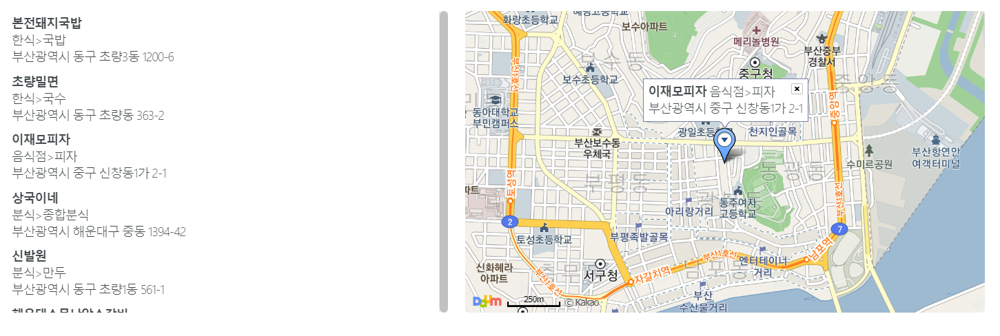

# 6.Using MapApi in React

> 리액트에서 맵 api를 사용한 경험을 바탕으로 작성하였습니다.

## Overview

프로젝트에서 해야할 일은 네이버 api로 받아온 좌표를 다음 맵으로 보여주는 일이였다.

우선 네이버 지도 api를 사용하려고 하였으나 


네이버 클라우드 플랫폼에서 신규 계정을 발급받아 사용하여야하였다. 

이 공지사항을 뒤늦게 확인하여 괜한 삽질만 3시간동안 하였다. ㅠㅠ


우선 네이버 클라우드 플랫폼에서 신규계정을 발급받으려면 카드등록을 해야한다. 한도도 정할 수 있긴한데, 프로젝트를 완성하고 기업에게 줘야하는 입장이라 별로 사용하고 싶지 않았다. 

(뭔가 자동결제라고 하니까 돈이 빠져나갈것 같다 ㅠㅠ)

따라서 바로 다음 지도로 경로를 변경했다.


------------

## 다음 지도 시작하기

여러분은 간단한 코드를 통해 웹브라우저에 지도를 띄울 수 있습니다.
차근차근 한 단계씩 진행해 보도록 하겠습니다.

### 지도를 담을 영역 만들기

먼저 지도를 담기 위한 영역이 필요합니다. `500x400` 의 크기로 만들어 보겠습니다.

```
<div id="map" style="width:500px;height:400px;"></div>
```

지도를 담을 영역으로 스타일이 지정된 `<div>` 태그를 선언합니다.
`<div>` 태그의 id값은 `map` 으로 하도록 하겠습니다.

### 실제 지도를 그리는 Javascript API를 불러오기

```html
<script type="text/javascript" src="//dapi.kakao.com/v2/maps/sdk.js?appkey=발급받은 APP KEY를 넣으시면 됩니다."></script>
```

`//` 이라는 상대 프로토콜을 사용하면, 사용자의 `http`, `https` 환경에 따라 자동으로 해당 프로토콜을 따라가게 됩니다.

API를 로딩하는 스크립트 태그는 HTML파일안의 `head`, `body` 등 어떠한 위치에 넣어도 상관없습니다.
하지만, 반드시 **실행 코드보다 먼저 선언되어야 합니다.**

스크립트 코드를 리액트 프로젝트에서 **index.html** 파일 상단에 붙여 넣는다.

```html
<!DOCTYPE html>
<html lang="en">
  <head>
    <meta charset="utf-8" />
    <link rel="shortcut icon" href="%PUBLIC_URL%/favicon.ico" />
    <meta
      name="viewport"
      content="width=device-width, initial-scale=1, shrink-to-fit=no"
    />
    <meta name="theme-color" content="#000000" />
    <link rel="manifest" href="%PUBLIC_URL%/manifest.json" />
    <script type="text/javascript" src="//dapi.kakao.com/v2/maps/sdk.js?appkey=d698315979c98f65a32752dc88bd959d"></script>
    <script type="text/javascript" src="//dapi.kakao.com/v2/maps/sdk.js?appkey=APIKEY&libraries=LIBRARY"></script>

    <title>Ad Tech</title>

  </head>
  <body>
    <noscript>You need to enable JavaScript to run this app.</noscript>
    <div id="root"></div>
    
  </body>
</html>
```

**붙여넣고 서버를 켜야한다!!! 아니면 script파일이 로딩되지 않는다.**

### 지도를 띄우는 코드 작성

```javascript
var container = document.getElementById('map'); //지도를 담을 영역의 DOM 레퍼런스
var options = { //지도를 생성할 때 필요한 기본 옵션
	center: new daum.maps.LatLng(33.450701, 126.570667), //지도의 중심좌표.
	level: 3 //지도의 레벨(확대, 축소 정도)
};

var map = new daum.maps.Map(container, options); //지도 생성 및 객체 리턴
```

*Map* 객체의 두 번째 파라메터로 넣는 `options` 의 속성 중, `center` 는 **지도를 생성하는데 반드시 필요합니다.**
`center` 에 할당할 값은 *LatLng* 클래스를 사용하여 생성합니다. 흔히 위경도 좌표라고 부르는 `WGS84` 좌표계의 좌표값을 넣어서 만드는데요, 생성인자는 `위도(latitude), 경도(longitude)` 순으로 넣어주세요.

### 리액트 코드

```javascript
import React, { Component } from 'react';
import './App.css';    

class App extends Component {
    componentDidMount() {                                                    
      let el = document.getElementById('map');
      let map = new daum.maps.Map(el, {
        center: new daum.maps.LatLng(/* latitude */, /* longitude */)
      });
    }
                                                    
    render() {
      return (
        <div className="App" id="map"></div>
      );
    }
}

export default App;
```


### 네이버 지역 API로 받은 카텍좌표계를 Latitude, longitude로 변환하기

네이버 지역 api에서 받은 mapx, mapy 좌표를 다음 지도에 마커로 표시해주는 작업이 남았다.

네이버 지역 api의 경우 다음과 같이 카텍좌표계 값으로 주기때문에 다음 지도에 그대로 넣어주게 되면 안된다.


이때 좌표를 변환해주는 작업이 필요하다.

변환 모듈인 `proj4`를 설치해주자

``` shell
npm i proj4
```

이후 변환할 공식을 정의해준다.

```javascript
proj4.defs('TM128','+proj=tmerc +lat_0=38 +lon_0=128 +k=0.9999 +x_0=400000 +y_0=600000 +ellps=bessel +units=m +no_defs +towgs84=-115.80,474.99,674.11,1.16,-2.31,-1.63,6.43');
proj4.defs('EPSG:5179','+proj=tmerc +lat_0=38 +lon_0=127.5 +k=0.9996 +x_0=400000 +y_0=600000 +ellps=GRS80 +units=m +no_defs');
proj4.defs('WGS84', "+title=WGS 84 (long/lat) +proj=longlat +ellps=WGS84 +datum=WGS84 +units=degrees");
```

그리고 변환하면 완성!!!!!!

### 리액트 코드

*popup.js* 코드의 경우 핵심 부분만 첨부하였습니다.

```javascript
//component/popup.js
import React from 'react';
import ScrollBar from 'react-free-scrollbar';
import * as api from '../lib/api';
import '../common/css/popupstyle.css';
import NameItem from './NameItem';
import * as marker from '../lib/marker';

class PopUp extends React.Component { 
    map;
    componentDidMount(){

        var container = document.getElementById('myMap'); //지도를 담을 영역의 DOM 레퍼런스
        var options = { //지도를 생성할 때 필요한 기본 옵션
            center: new window.daum.maps.LatLng(35.157588, 129.058822), //지도의 중심좌표.
            level: 5 //지도의 레벨(확대, 축소 정도)
        };
        
        this.map = new window.daum.maps.Map(container, options); //지도 생성 및 객체 리턴
    }
    //items = new Array();
    getData = async (e) => {
        e.preventDefault();
        console.log(this.state.name);
        try {
            const response = await api.getAPOD(this.state.name);
            await console.log(response.items.length);
            this.setState({
                items: []
            })
            for(let i=0;i<response.items.length;i++){
                let tmpTitle = response.items[i].title;
                tmpTitle = tmpTitle.replace("<b>","");
                tmpTitle = tmpTitle.replace("</b>","");
                this.setState({
                    items: this.state.items.concat({
                        id: i,
                        title : tmpTitle,
                        category : response.items[i].category,
                        address : response.items[i].address,
                        mapx : response.items[i].mapx,
                        mapy : response.items[i].mapy
                    })
                })
            }
            // await console.log(this.state.items);
        } 
        catch (e) {
            // 오류가 났을 경우
            console.log(e);
        }  
    }
    
    handleChange = (e) => {
        this.setState({
            [e.target.name]: e.target.value
        })
    }   

    handleToggle = (id) => {
        const { items } = this.state;
        const index = items.findIndex(item => item.id === id);
        const selected = items[index]; // 선택한 객체
        this.props.autoInput(selected.title, selected.address);
        marker.createMarker(this.map,selected);
    }
    
    render() {
        const List = this.state.items.map(
            ({id, title, category, address, mapx, mapy}) => (
                <NameItem
                    id={id}
                    title={title}
                    category={category}
                    address={address}
                    mapx={mapx}
                    mapy={mapy}
                    key={id}
                    onToggle={this.handleToggle}
                />
            )
        )
        
        return (
            <div className='popup'>
              	<ScrollBar style={{width: "45%", height: "100%"}}>
                 	<ul>
                   		{List}
        		 	</ul>
        		</ScrollBar>
        		<div id='myMap'/>                          
            </div>
        )
    }
}
export default PopUp;
```


```javascript
//component/createMarker.js

import proj4 from 'proj4';

var marker = null;
var infowindow = null;

export function createMarker(map,data){
    console.log(data);
    const title = data.title;
    const address = data.address;
    const category = data.category;
    const mapx = data.mapx;
    const mapy = data.mapy;

    //좌표 변환
    proj4.defs('TM128','+proj=tmerc +lat_0=38 +lon_0=128 +k=0.9999 +x_0=400000 +y_0=600000 +ellps=bessel +units=m +no_defs +towgs84=-115.80,474.99,674.11,1.16,-2.31,-1.63,6.43');
    proj4.defs('EPSG:5179','+proj=tmerc +lat_0=38 +lon_0=127.5 +k=0.9996 +x_0=400000 +y_0=600000 +ellps=GRS80 +units=m +no_defs');
    proj4.defs('WGS84', "+title=WGS 84 (long/lat) +proj=longlat +ellps=WGS84 +datum=WGS84 +units=degrees");
    var transform = proj4('TM128','WGS84',[parseFloat(mapx),parseFloat(mapy)])
    
    var moveLatLon = new window.daum.maps.LatLng(transform[1], transform[0]);

    // 지도 중심을 부드럽게 이동시킵니다
    map.panTo(moveLatLon);
    // 만약 이동할 거리가 지도 화면보다 크면 부드러운 효과 없이 이동합니다
    //this.map.setCenter(moveLatLon);

    //기존에 생성된 마커제거
    if(marker!=null){
        marker.setMap(null);  
        infowindow.close();    
    }

    var markerPosition  = new window.daum.maps.LatLng(transform[1], transform[0]); 

    // 마커를 생성합니다
    marker = new window.daum.maps.Marker({
        position: markerPosition
    });

    // 마커가 지도 위에 표시되도록 설정합니다
    marker.setMap(map);

    //인포윈도우
var iwContent = `<div style="padding:5px;"><strong>${title}</strong>  ${category}<br>${address}</a></div>`, // 인포윈도우에 표출될 내용으로 HTML 문자열이나 document element가 가능합니다
    iwRemoveable = true, 
    
    iwPosition = new window.daum.maps.LatLng(transform[1], transform[0]); //인포윈도우 표시 위치입니다

    // 인포윈도우를 생성합니다
    infowindow = new window.daum.maps.InfoWindow({
        position : iwPosition, 
        content : iwContent,
        removable : iwRemoveable
    });
    
    // 마커 위에 인포윈도우를 표시합니다. 두번째 파라미터인 marker를 넣어주지 않으면 지도 위에 표시됩니다
    infowindow.open(map, marker);    
}
```


### 결과 화면




### Reference

* [React에서 다음 api활용](https://devtalk.kakao.com/t/react-api/43110/5)

* [react에서 daum map api 사용중, 질문드립니다.](https://okky.kr/article/431597)

* [NodeJs 에서의 좌표계 변환관련한 모듈이나 API가 제공되나요?](https://github.com/navermaps/maps.js/issues/285)

* [Nodejs에서 proj4 사용하기](http://stratosphere.tistory.com/143)

* [인포윈도우 생성하기](http://apis.map.daum.net/web/sample/basicInfoWindow/)

