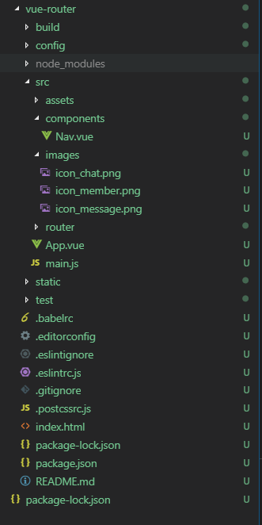
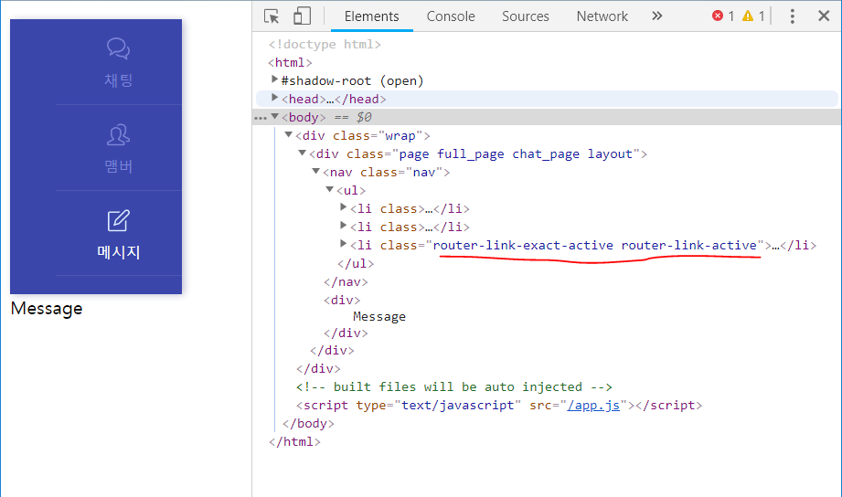

# 9.Vue.js_NavigationBar(router)

> navigation bar와 router 사용하는 법을 정리하였다.

## Setting


```shell
$ vue init webpack vue-router
```



src 디렉토리에 예제로 사용할 png파일 3개를 추가하였다.

## Nav component 추가

`src/components/Nav.vue`

```vue
<template>
  <!-- nav -->
    <nav class="nav">
        <ul>
            <router-link tag='li' to="/chat">
                <div class="menu_icon">
                    
                </div>
                <div class="menu">채팅</div>
            </router-link>
            <router-link tag='li' to="/member" exact>
                <div class="menu_icon">
                    
                </div>
                <div class="menu">맴버</div>
            </router-link>
            <router-link tag='li' to="/message" exact>
                <div class="menu_icon">
                    
                </div>
                <div class="menu">메시지</div>
            </router-link>
        </ul>
    </nav>
</template>

<script>
export default {
  name: 'Nav',
  data () {
    return {
      active: 'home'
    }
  }
}
</script>

<style>
    ul{ list-style:none;}
    .nav{top:0;left:0;width:150px;height:100%;background:#3B46AB;box-shadow: 2px 1px 10px 0 rgba(38,44,103,0.32);z-index:50;}
    .nav > ul > li{position:relative;height:74px;border-bottom:1px solid #4D57B2;text-align:center;}
    .nav > ul > li > a{}
    .nav > ul > li .menu{font-size:13px;color:#7B84D6;padding-top:4px;}
    .nav > ul > li .menu_icon img{width:20px;height:20px;padding-top:16px;}
</style>

```

## router component 

`src/component/Chat.vue`

```vue
<template>
  <div>
      {{msg}}
  </div>
</template>

<script>
export default {
  name: 'Chat',
  data () {
    return {
      msg: 'chat'
    }
  }
}
</script>

```

`src/component/Member.vue`

```vue
<template>
  <div>
      Member
  </div>
</template>

<script>
export default {
  name: 'Member',
  data () {
    return {
    }
  }
}
</script>

```

`src/component/Message.vue`

```vue
<template>
  <div>
      Message
  </div>
</template>

<script>
export default {
  name: 'Message',
  data () {
    return {    
    }
  }
}
</script>

```

## router index.js

`src/router/index.js`

```javascript                                                                                 ,
import Vue from 'vue'
import Router from 'vue-router'
import Chat from '@/components/Chat'
import Member from '@/components/Member'
import Message from '@/components/Message'

Vue.use(Router)

export default new Router({
  routes: [
    {
      path: '/Chat',
      name: 'Chat',
      component: Chat
    },
    {
      path: '/Member',
      name: 'Member',
      component: Member
    },
    {
      path: '/Message',
      name: 'Message',
      component: Message
    }
  ]
})

```


기본적인 셋팅은 끝났다.

```shell
$ npm run dev
```

로 실행해 보면 nav을 클릭할 때마다 url이 변경되는 것을 확인할 수 있다.


## 라우터 링크 스타일

라우터링크는 스타일과 관련된 사항이 더 있다. 경로에 따라 CSS 클래스 명이 자동으로 추가되는 것이다.

/posts/new 경로에서는 `<router-link to="/posts/new">` 링크에 클래스 명이 추가되는데 .router-link-active와 .router-link-exact-active 클래스다.

- `.router-link-active`: 경로 앞부분만 일치해서 추가되는 클래스
- `.router-link-exact-active`: 모든 경로가 일치해야만 추가되는 클래스

뷰js가 알아서 CSS 클래스명을 추가하기 때문에 개발자는 클래스 정의만 추가하면 된다. 루트 어플리케이션에 CSS를 추가한다.




`src/component/Nav.vue`

```vue
...
<style>
    ...
    nav li.router-link-exact-active .menu{
        color: white;
    }
    nav li.router-link-exact-active .menu_icon {
        filter: brightness(1.8);
    }
</style>
```


## 결과물


### reference

* [Vue-Router 살펴보기](http://blog.jeonghwan.net/2018/04/07/vue-router.html)
* [공식문서](https://router.vuejs.org/kr/)