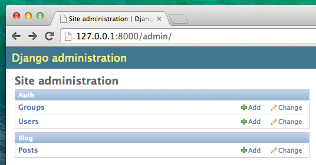
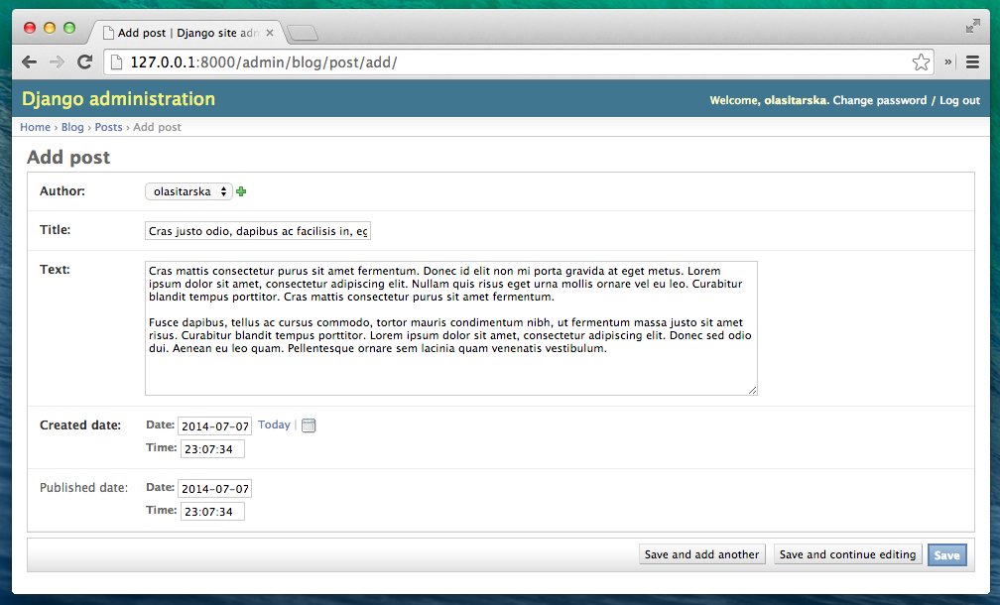

# Django

## 장고 설치하기

먼저 가상환경(Virtual environment)를 만들어준다. 

```shell
mkdir project
cd project
```

이제 `env` 라는 이름의 가상환경을 만듭니다.

```shell
python -m venv env
```

가상환경 실행하기

```shell
env\Scripts\activate.bat
```

콘솔의 프롬프트 앞에 (env) 접두어가 붙어있다면 `virtualenv` 가 시작되었음을 알 수 있다.

먼저 장고를 설치하는 데 필요한 `pip` 이 최신 버전인지 확인한다.

```shell
(env) ~$ python3 -m pip install --upgrade pip
(env) ~$ pip install django 
```


## 장고 프로젝트 시작!

장고에서는 데릭토리와 파일명이 매우 중요하다. 파일명을 마음대로 변경해서도 안되고 다른 곳으로 옮겨도 안된다. 장고는 중요한 것들을 찾을 수 있게 특정한 구조를 유지해야 한다.

> 모든 작업은 가상환경(virtualenv) 안에서 해야한다. 현재 콘솔 창에서 접두어로 (env) 가 안보인다면 virtualenv를 활성화해야 한다. 

```shell
(env) ~$ django-admin.py startproject mysite .
```

`django-admin.py` 은 스크립트로 데렉토리와 파일들을 생성합니다. 스크립트 실행 후에는 아래와 같이 새로 만들어진 디렉토리 구조를 볼 수 있다.

```
project
├───manage.py
└───mysite
        settings.py
        urls.py
        wsgi.py
        __init__.py
```

`manage.py` 는 스크립트인데, 사이트 관리를 도와주는 역할을 합니다. 이 스크립트로 다른 설치 작업 없이, 컴퓨터에서 웹 서버를 시작할 수 있습니다.

`settings.py` 는 웹사이트 설정이 있는 파일입니다.

`urls.py` 파일은 `urlresolver` 가 사용하는 패턴 목록을 포함하고 있습니다.

### 설정 변경

`mysite/settings.py` 을 조금 고쳐 보겠습니다.

```python
# mysite/settings.py

STATIC_URL = '/static/'
STATIC_ROOT = os.path.join(BASE_DIR, 'static')
```

`DEBUG`가`True`이고 `ALLOWED_HOSTS`가 비어 있으면, 호스트는 `['localhost', '127.0.0.1', '[::1]']`에 대해서 유효합니다. 애플리케이션을 배포할 때 PythonAnywhere의 호스트 이름과 일치하지 않으므로 다음 설정을 아래와 같이 변경해줘야 합니다. :

```python
# mysite/settings.py

ALLOWED_HOSTS = ['127.0.0.1', '.pythonanywhere.com']
```


## 데이터베이스 설정하기

사이트 내 데이터를 저장하기 위한 많은 다양한 데이터베이스 소프트웨어들이 있습니다. 그중에서 우리는 `sqlite3`을 사용할 거예요.

이미 `mysite/settings.py`파일 안에 설치가 되어있어요.

```python
# mysite/settings.py

DATABASES = {
    'default': {
        'ENGINE': 'django.db.backends.sqlite3',
        'NAME': os.path.join(BASE_DIR, 'db.sqlite3'),
    }
}
```

블로그에 데이터베이스를 생성하기 위해서 콘솔 창에서 아래 코드를 실행하세요. : `python manage.py migrate` (이 명령을 실행하기 위해서는 `project`디렉터리 안에 있는 `manage.py`가 필요합니다)

잘 작동되면, 아래와 같은 내용이 나옵니다.

```shell
(env) ~/project$ python manage.py migrate
Operations to perform:
  Apply all migrations: auth, admin, contenttypes, sessions
Running migrations:
  Rendering model states... DONE
  Applying contenttypes.0001_initial... OK
  Applying auth.0001_initial... OK
  Applying admin.0001_initial... OK
  Applying admin.0002_logentry_remove_auto_add... OK
  Applying contenttypes.0002_remove_content_type_name... OK
  Applying auth.0002_alter_permission_name_max_length... OK
  Applying auth.0003_alter_user_email_max_length... OK
  Applying auth.0004_alter_user_username_opts... OK
  Applying auth.0005_alter_user_last_login_null... OK
  Applying auth.0006_require_contenttypes_0002... OK
  Applying auth.0007_alter_validators_add_error_messages... OK
  Applying sessions.0001_initial... OK
```

잘했어요! 이제 웹 서버를 시작해 웹 사이트가 잘 작동하는지 확인해봐요!

프로젝트 디렉토리(`project`)에 `manage.py`파일이 있어야 합니다. 콘솔에서는 `python manage.py runserver`명령을 실행해, 웹 서버를 바로 시작할 수 있습니다.

### 어플리케이션 만들기

잘 정돈된 상태에서 시작하기 위해, 프로젝트 내부에 별도의 애플리케이션을 만들어볼 거에요. 처음부터 모든 것이 잘 준비되어있다면 훌륭하죠. 애플리케이션을 만들기 위해 콘솔 창(`project` 디렉토리에서 `manage.py` 파일)에서 아래 명령어를 실행하세요.

```shell
(myvenv) ~/project$ python manage.py startapp blog
```

이제 `blog`디렉터리가 생성되고 그 안에 여러 파일도 같이 들어있는 것을 알 수 있어요. 현재 디렉리와 파일들은 다음과 같을 거예요. :

```shell
    project
    ├── mysite
    |       __init__.py
    |       settings.py
    |       urls.py
    |       wsgi.py
    ├── manage.py
    └── blog
        ├── migrations
        |       __init__.py
        ├── __init__.py
        ├── admin.py
        ├── models.py
        ├── tests.py
        └── views.py
```

애플리케이션을 생성한 후 장고에 사용해야 한다고 알려줘야 합니다. 이 역할을 하는 파일이 `mysite/settings.py`입니다. 이 파일 안에서 `INSTALLED_APPS`를 열어, `)`바로 위에 `'blog'`를 추가하세요. 최종 결과물은 아래와 다음과 같을 거예요. :

```python
# mysite/settings.py

INSTALLED_APPS = [
    'django.contrib.admin',
    'django.contrib.auth',
    'django.contrib.contenttypes',
    'django.contrib.sessions',
    'django.contrib.messages',
    'django.contrib.staticfiles',
    'blog',
]
```

### 블로그 글 모델 만들기

모든 `Model` 객체는 `blog/models.py` 파일에 선언하여 모델을 만듭니다. 이 파일에 우리의 블로그 글 모델도 정의할 거에요.

`blog/models.py` 파일을 열어서 안에 모든 내용을 삭제한 후 아래 코드를 추가하세요.

```python
# blog/models.py

from django.db import models
from django.utils import timezone


class Post(models.Model):
    author = models.ForeignKey('auth.User', on_delete=models.CASCADE)
    title = models.CharField(max_length=200)
    text = models.TextField()
    created_date = models.DateTimeField(
            default=timezone.now)
    published_date = models.DateTimeField(
            blank=True, null=True)

    def publish(self):
        self.published_date = timezone.now()
        self.save()

    def __str__(self):
        return self.title
```

`from` 또는 `import`로 시작하는 부분은 다른 파일에 있는 것을 추가하라는 뜻입니다. 다시 말해, 매번 다른 파일에 있는 것을 복사&붙여넣기로 해야 하는 작업을 `from`이 대신 불러와 주는 거죠.

`class Post(models.Model):`는 모델을 정의하는 코드입니다. (모델은 `객체(object)`라고 했죠?)

- `class`는 특별한 키워드로, 객체를 정의한다는 것을 알려줍니다.
- `Post`는 모델의 이름입니다. (특수문자와 공백 제외한다면) 다른 이름을 붙일 수도 있습니다. 항상 클래스 이름의 첫 글자는 대문자로 써야 합니다.
- `models`은 Post가 장고 모델임을 의미합니다. 이 코드 때문에 장고는 Post가 데이터베이스에 저장되어야 한다고 알게 됩니다.

이제 속성을 정의하는 것에 대해서 이야기해 볼게요. `title`, `text`, `created_date`, `published_date`, `author`에 대해서 말할 거에요. 속성을 정의하기 위해, 필드마다 어떤 종류의 데이터 타입을 가지는지를 정해야 해요. 여기서 데이터 타입에는 텍스트, 숫자, 날짜, 사용자 같은 다른 객체 참조 등이 있습니다.

- `models.CharField` - 글자 수가 제한된 텍스트를 정의할 때 사용합니다. 글 제목같이 짧은 문자열 정보를 저장할 때 사용합니다.
- `models.TextField` - 글자 수에 제한이 없는 긴 텍스트를 위한 속성입니다. 블로그 콘텐츠를 담기 좋겠죠?
- `models.DateTimeField` - 날짜와 시간을 의미합니다.
- `models.ForeignKey` - 다른 모델에 대한 링크를 의미합니다.

시간 관계상 모든 코드를 하나하나 다 설명하지는 않을 거예요. 대신 모델의 필드와 정의하는 방법에 궁금하다면 장고 공식 문서를 꼭 읽어보길 바랍니다. : <https://docs.djangoproject.com/en/1.11/ref/models/fields/#field-types>)

`def publish(self):`는 무슨 뜻일까요? 이것이 바로 앞서 말했던 `publish`라는 메서드(method) 입니다. `def`는 이것이 함수/메서드라는 뜻이고, `publish`는 메서드의 이름입니다. 원한다면 메서드 이름을 변경할 수도 있어요. 이름을 붙일 때는 공백 대신, 소문자와 언더스코어를 사용해야 합니다. 예를 들어, 평균 가격을 계산하는 메서드는 `calculate_average_price`라고 부를 수 있겠네요.

메서드는 자주 무언가를 되돌려주죠. (`return`) 그 예로 `__str__` 메서드를 봅시다. 이 시나리오대로라면, `__str__`를 호출하면 Post 모델의 제목 텍스트(**string**)를 얻게 될 거에요.

아직 모델에 대해서 잘 모르는 부분이 있다면, 코치에게 자유롭게 물어보세요! 지금 배운 내용이 너무 복잡하게 느껴질 수 있어요. 객체와 함수를 배운 적이 없는 분들이 한꺼번에 배우게 된다면 특히 그렇겠죠. 그래도 해 볼 만한 마법이라고 생각했으면 좋겠어요!

### 데이터베이스에 모델을 위한 테이블 만들기

이 장의 마지막 단계입니다. 이제 데이터베이스에 우리의 새 모델, Post 모델을 추가할 거에요. 먼저 우리는 장고 모델에 (우리가 방금 만든!) 몇 가지 변화가 생겼다는 걸 알게 해줘야 합니다. `python manage.py makemigrations blog` 를 입력해 보세요. 아마도 화면에 이렇게 보이겠죠?

```shell
(myvenv) ~/project$ python manage.py makemigrations blog
Migrations for 'blog':
  blog/migrations/0001_initial.py:
  - Create model Post
```

장고는 데이터베이스에 지금 반영할 수 있도록 마이그레이션 파일(migration file)이라는 것을 준비해 두었답니다. 이제 `python manage.py migrate blog` 명령을 실행해, 실제 데이터베이스에 모델 추가를 반영하겠습니다. :

```shell
(myvenv) ~/project$ python manage.py migrate blog
Operations to perform:
  Apply all migrations: blog
Running migrations:
  Rendering model states... DONE
  Applying blog.0001_initial... OK
```

# 장고 관리자

관리자 화면을 한국어로 변경하길 원할 경우 'settings.py'중 `LANGUAGE_CODE = 'en-us'`를 `LANGUAGE_CODE = 'ko'`로 바꾸세요.

방금 막 모델링 한 글들을 장고 관리자에서 추가하거나 수정, 삭제할 수 있어요.

이제 `blog/admin.py` 파일을 열어서 내용을 다음과 같이 바꾸세요.

```python
# blog/admin.py

from django.contrib import admin
from .models import Post

admin.site.register(Post)
```

코드에서 알 수 있듯이 앞 장에서 정의했던 `Post`모델을 가져오고(import) 있어요. 관리자 페이지에서 만든 모델을 보려면 `admin.site.register(Post)`로 모델을 등록해야 해요.

자, 이제 `Post`모델을 볼까요? 웹 서버를 실행하려면 콘솔 창에서 `python manage.py runserver`를 실행하는걸 잊지 마세요. 브라우저를 열고 주소창에 <http://127.0.0.1:8000/admin/>을 입력하면 아래와 같은 로그인 페이지를 볼 수 있어요.


로그인하기 위해서는, 모든 권한을 가지는 *슈퍼 사용자(superuser)*를 생성해야 해요. 커맨드라인으로 돌아가서 `python manage.py createsuperuser`을 입력하고 엔터를 누르세요.

메시지가 나타나면 사용자 이름 (소문자, 공백 없이), 이메일 주소 및 암호를 입력합니다. password를 입력할 때 화면에 글자가 보이지 않는다고 해도 걱정하지 마세요. 원래 password는 화면에 보이지 않습니다. 작성한 후에 `enter`를 누르세요. 실행화면은 아래와 같을 거예요. (슈퍼 사용자로 사용할 username 과 email 주소는 본인 계정을 사용하세요) :

```shell
(myvenv) ~/djangogirls$ python manage.py createsuperuser
Username: admin
Email address: admin@admin.com
Password:
Password (again):
Superuser created successfully.
```

브라우저로 돌아와서 장고 관리자 페이지에서 슈퍼 사용자로 로그인한 후 대시보드를 확인하세요.



게시글로 가서 이것저것 시도해보세요. 5~6개 블로그 포스트를 올려보세요. 안에 내용은 걱정하지 마세요. 튜토리얼에 있는 텍스트를 그냥 복사붙여넣기를 할 수 있으니까요.

최소한 2, 3개의 글에 게시 날짜가 있는지 확인하세요. (모두 볼 필요는 없어요) 이건 나중에 도움이 될 거에요.



장고 관리자에 대해서 좀 더 알고 싶다면 장고 공식 문서를 읽어보세요 : <https://docs.djangoproject.com/en/1.8/ref/contrib/admin/>

## 장고 URL은 어떻게 작동할까요?

코드 에디터에서 `mysite/urls.py`파일을 열면 아래 내용이 보일 거에요.

```python
"""mysite URL Configuration

[...]
"""
from django.conf.urls import url
from django.contrib import admin

urlpatterns = [
    url(r'^admin/', admin.site.urls),
]
```

장고가 이미 어떤 내용을 넣어 두었네요.

관리자 URL도 여기에 이미 있어요.

```python
    url(r'^admin/', admin.site.urls),
```

장고는 `admin/`로 시작하는 모든 URL을 *view*와 대조해 찾아냅니다. 무수히 많은 URL이 `admin URL`에 포함될 수 있어 일일이 모두 쓸 수 없답니다. 그래서 정규표현식을 사용합니다.

## 정규표현식(Regex)

장고가 URL을 뷰에 매칭시키는 방법이 궁금하죠? 이 부분은 조금 어렵게 느껴질 수 있어요. 장고는 `regex`를 사용하는데, 이는 `정규표현식(regular expressions)`의 줄임말입니다. 정규식은 정말 (아주!) 많은 검색 패턴의 규칙을 가지고 있어요. 정규식은 어려운 내용이라 자세하게 알아보지 않을 거에요.

URL패턴 만드는 방법이 궁금하다면, 다음 표기법을 확인하세요. 이 중 몇 가지 규칙만 사용할 거에요.

- ^ : 문자열이 시작할 떄
- $ : 문자열이 끝날 때
- \d : 숫자
- - : 바로 앞에 나오는 항목이 계속 나올 때
- () : 패턴의 부분을 저장할 때

이외에도 문자열을 이용해 url을 만들 수 있어요.

`http://www.mysite.com/post/12345/`라는 사이트가 있다고 합시다. 여기에서 `12345`는 글 번호를 의미합니다.

뷰마다 모든 글 번호을 일일이 매기는 것은 정말 힘들죠. 정규표현식으로 url패턴을 만들어 숫자값과 매칭되게 할 수 있어요. 이렇게 말이죠. `^post/(\d+)/$`. 어떤 뜻인지 하나씩 살펴봅시다.

- **^post/** : url이(오른쪽부터) `post/`로 시작합니다.
- **(\d+)** : 숫자(한 개 이상)가 있습니다. 이 숫자로 조회하고 싶은 게시글을 찾을 수 있어요.
- **/** : `/`뒤에 문자가 있습니다.
- **$** : url 마지막이 `/`로 끝납니다.

## 나의 첫 번째 Django url!

첫 번째 URL을 만들어 봅시다! 우리는 '<http://127.0.0.1:8000/>'가 홈페이지 주소로 만들어 글 목록이 보이게 만들어 볼 거에요.

또한 `mysite/urls.py`파일을 깨끗한 상태로 유지하기 위해, `blog` 애플리케이션에서 메인 `mysite/urls.py`파일로 url들을 가져올 거에요.

먼저 `#`로 시작하는 줄을 삭제하고 `main url('')`로 `blog.urls`를 가져오는 행을 추가해 봅시다.

이제 `mysite/urls.py` 파일은 아래처럼 보일 거에요.

```python
from django.conf.urls import include, url
from django.contrib import admin

urlpatterns = [
    url(r'^admin/', admin.site.urls),
    url(r'', include('blog.urls')),
]
```

지금 장고는 <http://127.0.0.1:8000/> 로 들어오는 모든 접속 요청을 `blog.urls`로 전송해 추가 명령을 찾을 거예요.

파이썬에서 정규 표현식을 작성할 때는 항상 문자열 앞에 `r`을 붙입니다. 이는 파이썬에게는 별 의미가 없지만, 파이썬에게 문자열에 특수 문자를 있다는 것을 알려줍니다.

## blog.urls

`blog/urls.py`이라는 새 파일을 생성하세요. 좋아요! 이제 아래 두 줄을 추가하세요.

```python
# blog/urls.py

from django.conf.urls import url
from . import views
```

우리는 장고의 메소드와 `blog` 애플리케이션에서 사용할 모든 `views`를 불러오고 있어요. (물론 아직 뷰를 하나도 안 만들었지만, 곧 만들거니 조금만 기다리세요!)

그 다음, 첫 번째 URL 패턴을 추가하세요.

```python
urlpatterns = [
    url(r'^$', views.post_list, name='post_list'),
]
```

이제 `post_list`라는 이름의 `view`가 `^$` URL에 할당되었습니다. 이 정규표현식은 `^`에서 시작해 `$`로 끝나는 지를 매칭할 것입니다. 즉 문자열이 아무것도 없는 경우만 매칭하겠죠. 틀린 것이 아니에요. 왜냐하면 장고 URL 확인자(resolver)는 '<http://127.0.0.1:8000/>' 는 URL의 일부가 아니기 때문입니다. 이 패턴은 장고에게 누군가 웹사이트에 '<http://127.0.0.1:8000/>' 주소로 들어왔을 때 `views.post_list`를 보여주라고 말할 거에요.

마지막 부분인 `name='post_list'`는 URL에 이름을 붙인 것으로 뷰를 식별합니다. 뷰의 이름과 같을 수도 완전히 다를 수도 있습니다. 이름을 붙인 URL은 프로젝트의 후반에 사용할 거예요. 그러니 앱의 각 URL마다 이름 짓는 것은 중요합니다. URL에 고유한 이름을 붙여, 외우고 부르기 쉽게 만들어야 해요.

<http://127.0.0.1:8000/> 접속했는데 '웹 페이지를 사용할 수 없음(web page not available)'이라는 메시지가 표시되었나요?. 이는 서버(`runserver`라고 입력하는 것을 기억 하는가?)가 실행되지 않았기 때문이에요. 에러가 발생한 이유를 찾으려면 서버 콘솔 창을 보세요. 

콘솔에서 에러가 발생했네요. 하지만 걱정하지 마세요. 에러는 해결할 방법을 알려준답니다. : **no attribute 'post_list'** 라는 메시지가 보일 텐데요. 이것은 장고가 찾고 사용하려고하는 *뷰*가 아직 없다는 거에요. 이 단계에서 `/admin/`로도 접속되지 않을 거에요. 앞으로 고쳐볼 테니 걱정하지 마세요.


### reference

+ https://tutorial.djangogirls.org/

