# Elastic 정리

> 프로젝트를 진행하면서 Elastic을 사용하게 되었다. 
> 따라서  Elastic에 관한 공부를 하면서 정리를 하고자한다.
> 관한 내용은 [elastic](https://www.elastic.co) 공식 사이트를 참고하였다.


## 1. Elastic: Product Portfolio

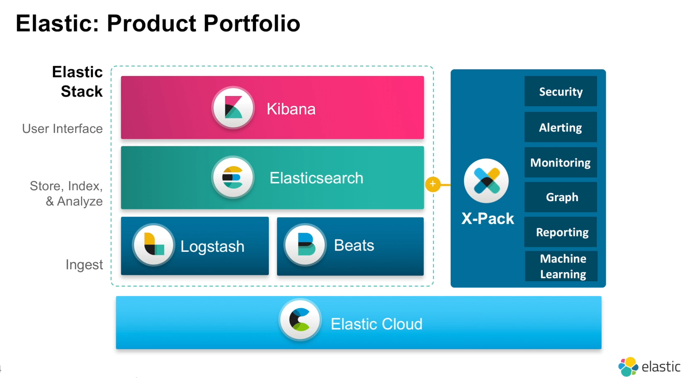

Elastic은 Kibana, Elasticsearch, Logstash, Beats로 묶여있다. 이를 Elastic Stack으로 부른다.추가적으로 상용 제품인 X-Pack(보안, 알림, 모니터링, 머신러닝등의 기능)과 Elastic Cloud()를 사용할 수 있다.

데이터를 색인하고 분석하는 일은 Elasticsearch에서 이루어진다. 그리고 저장된 data를 시각화 하는 일을 Kibana에서 담당한다. Logstash와 Beats는 log와 data를 수집하는 역할을 한다.


## 2. Elasticsearch

*Heart of the Elastic Stack*

- 모든 데이터가 저장
- 검색, 쿼리 실행
- 실시간, 풀텍스트 검색
- 많은 곳에서 데이터 저장소, 데이터 처리엔진으로 이용
- 오픈소스
- Apache Lucene이라는 검색 라이브러리 사용
- 분산시스템, scale out이 가능

### 구조

모든 데이터가 저장되며 검색, 필요한 쿼리들을 처리한다. 개발자들이 사용하기 편한 API를 제공하고 있다. 

Apache Lucene 이라는 검색 라이브러리를 사용하며 distrututed, scalable, highly available의 특징을 가지고 있다. 

모든 데이터들을 대용량으로 처리하기 때문에 클러스터 환경으로 동작을 한다.

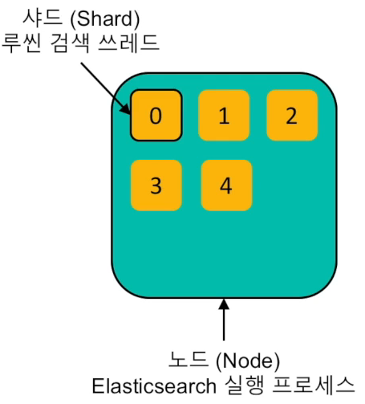

데이터는 샤드(Shard)라는 단위로 분리하여 저장한다. 그리고 Elasticsearch를 실행하는 한 프로세스를 Node라고 부른다. 

### 클러스터링 과정

1. 노드를 여러개 실행시키면 같은 클러스터로 묶인다. 

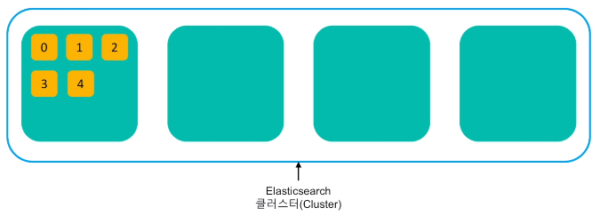

2. 샤드들은 각각의 노드들에 분배되어 저장된다.

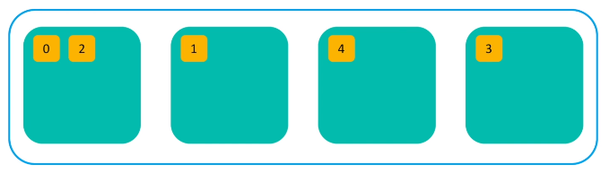

3. 무결성과 가용성을 위해 샤드의 복사본을 만든다. 같은 내용의 복제본과 샤드는 서로 다른 노드에 저장된다. 리플리카 라고 하는 복제본의 개수는 유동적으로 조절 가능하며, 복제본을 0~* 개 저장가능하다. 

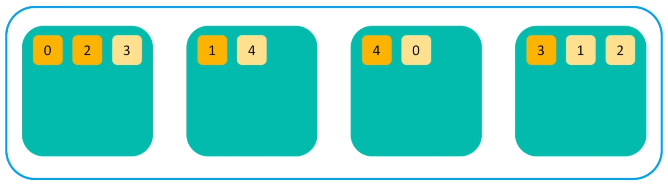

4. 시스템 다운이나 네트워크 단절 등으로 3번 node가 유실되면 0번과 4번 샤드가 하나씩 밖에 없기 떄문에 자신이 아닌 다른 노드로 복제본을 만든다.

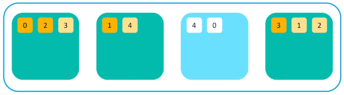

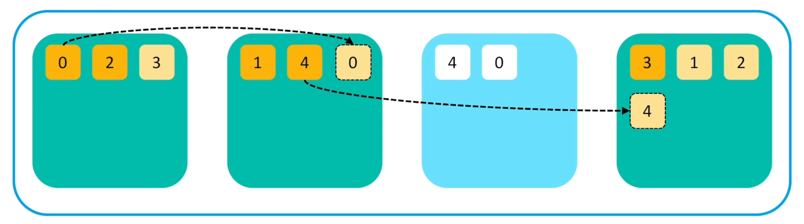

>  따라서 노드의 수가 줄어들어도 샤드의 수는 변함 없이 *무결성* 을 유지한다.

### 검색 과정

처음 쿼리 수행 명령을 받은 노드는 모든 샤드에게 쿼리를 전달한다. 

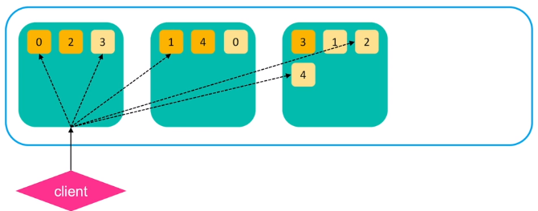

1차적으로 모든 샤드 검색을 실행한다. 각 샤드들은 요청된 크기만큼 검색 결과 큐를 노드로 리턴한다. 리턴된 결과는 루씬 doc id 와 랭킹 점수만 가지고 있다. 

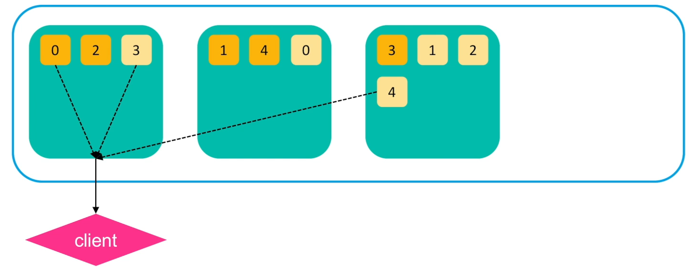

노드는 리턴된 결과들의 랭킹 점수를 기반으로 정렬한 뒤 유효한 샤드들에게 최종 결과들을 다시 요청한다. 

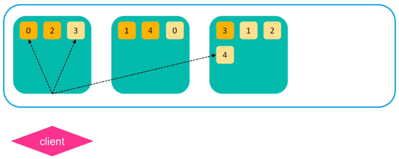

그 후 전체 문서 내용등의 정보가 리턴되어 클라이언트로 전달된다.

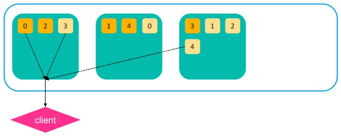

> 따라서 데이터 입력과 검색이 서로 다른 노드에서 실행되어도 상관없이 항상 샤드 레벨로 분배되어 검색한다. ex) 데이터가 1번 노드에 있는데 3번 노드로 검색해도 3번이 1번의 documnet를 가져와서 리턴할 수 있다.

### Elasticsearch is...

Elasticsearch는 **document-oriented** 검색엔진으로 기본적으로 JSON을 사용한다.

REST API를 제공하는데 port, index, type, documnet id를 한 uri로 표현한다. 

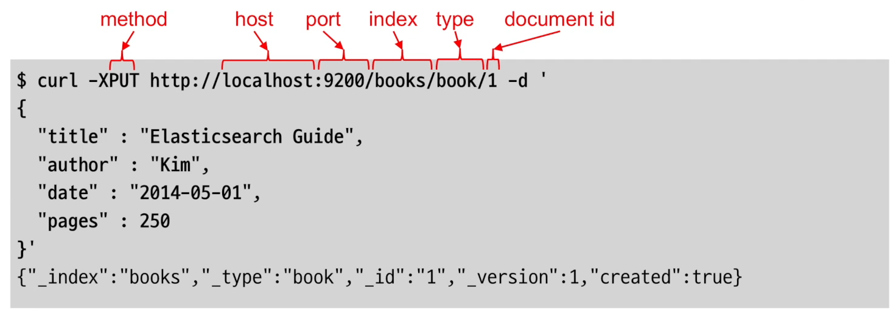

**full text search engin**이라는 특징을 가지고 있는데, 데이터를 저장할 때 처리의 과정을 거치게 된다. data를 검색이 가능한 형태로 가공을 해서 역색인 구조로 저장을 한다. 

**real-time search and analysis**이 가능하며 데이터가 저장될 때마다 index구조로 만들기 때문에 실시간으로 검색이나 쿼리가 가능하다.

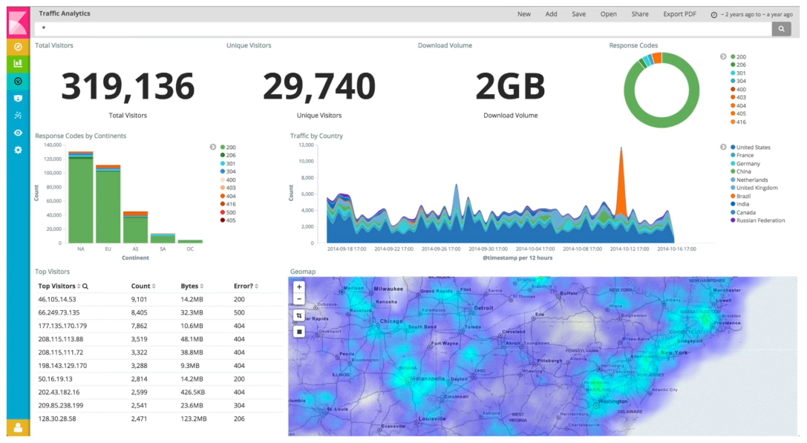

**Aggregation** 분석기능도 제공하여 저장하고 있는 데이터에 대하여 통계를 내는게 가능하다.

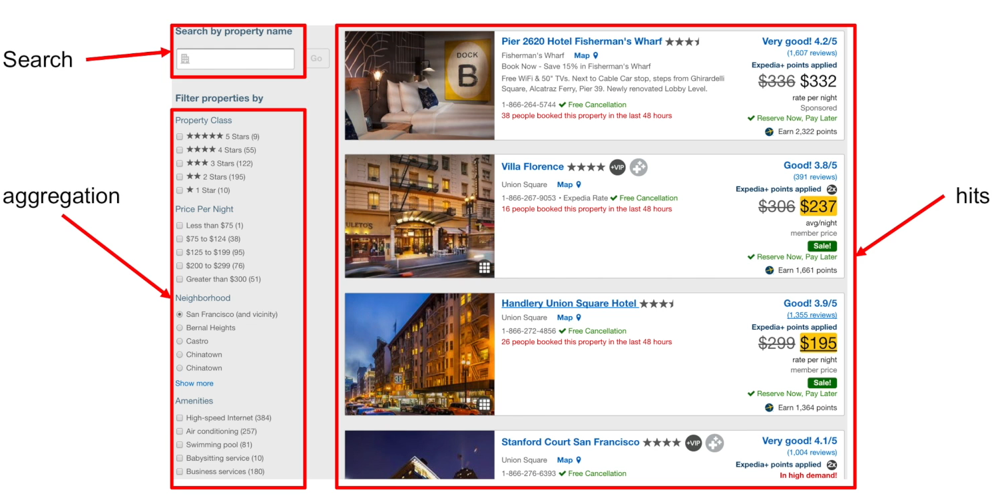


> node name, cluster name을 변경하고 싶으면 elasticsearch -> config -> elasticsearch.yml에가서 # 지우고 원하는 걸로 바꾸면 된다.
>
> ```shell
> #elasticsearch/config/elasticsearch.yml
> 
> ...
> # ---------------------------------- Cluster -----------------------------------
> #
> # Use a descriptive name for your cluster:
> #
> #cluster.name: my-application
> #
> # ------------------------------------ Node ------------------------------------
> #
> # Use a descriptive name for the node:
> #
> #node.name: node-1
> #
> # Add custom attributes to the node:
> #
> #node.attr.rack: r1
> ...
> ```
>
>
>
> 두 노드의 cluster name을 똑같이 해버리면 하나는 master가 되고 하나는 master에 join이 된다.
>
> 같은 호스트에서는 그냥 바인딩 되고, join된 것은 포트번호가 9200이 아니고 9201이 된다.


### Query (rest API)

> query 실행은 Kibana의 Dev Tools에서 하였다. 따라서 Elasticsearch와 Kibana를 순서대로 실행 시킨 후 Kibana의 Dev Tools에서 테스트해보면 된다.

1. **library 인덱스 생성**

   ```json
   PUT library
   {
       "settings": {
           "number_of_shards": 1,
           "number_of_replicas": 0
       }
   }
   ```

2. **Bulk 색인**

   대량의 document를 한꺼번에 색인 할 떄는 반드시 bulk API를 사용

   ```json
   POST library/books/_bulk
   {"index":{"_id":1}}
   {"title":"The quick brow fox","price":5,"colors":["red","green","blue"]}
   {"index":{"_id":2}}
   {"title":"The quick brow fox jumps over the lazy dog","price":15,"colors":["blue","yellow"]}
   {"index":{"_id":3}}
   {"title":"The quick brow fox jumps over the quick dog","price":8,"colors":["red","blue"]}
   {"index":{"_id":4}}
   {"title":"brow fox brown dog","price":2,"colors":["black","yellow","red","blue"]}
   {"index":{"_id":5}}
   {"title":"Lazy dog","price":9,"colors":["red","blue","green"]}
   ```

3. **검색**

   3.1 인덱스 전체 검색

   ```json
   GET library/_search
   ```

   3.2 match : title에 fox가 들어간 document 검색

	   ```json
   GET library/_search
   {
       "query": {
           "match": {
               "title": "fox"
           }
       }
   }
      ```

   title에 quick과 dog가 들어간 document 검색 (기본적으로 띄워쓰기는 OR를 의미)

   math가 많을 수록 score가 더 높다.

   ```json
   GET library/_search
   {
       "query": {
           "match": {
               "title": "quick fox"
           }
       }
   }
   ```

   3.3 match_phase : "quck dog'"는 한 문장이 들어간 걸 찾고 싶을땐 match가 아니라 match_phrase를 사용

   ```json
   GET library/_search
   {
       "query": {
           "match_phase": {
               "title": "quick fox"
           }
       }
   }
   ```


> 검색 결과에 "relevance" 알고리즘을 이용한 랭킹 적용(_score)
>
> - term frequency는 title 필드에서 quick이 몇 번이 나왔는지 보는 것
>
> - invert document frequency는 전체 문서에서 quick이 몇 번이 나왔는지 보는 것
>
> 자세한 내용은 Learn > Docs > Elasticsearch > The Definitive Guide > Getting Started > Sorting and Relevance를 참조 [링크](http://www.elastic.co/guide/en/elasticsearch/guide/current/relevance-intro.html)


4. **복합 쿼리** - bool 쿼리를 이용한 서브쿼리 조합

   4.1 must (AND 조건): "quick" 와 "lazy dog" 가 포함된 모든 문서 검색 

   ```json
   GET /library/_search
   {
       "query": {
           "bool": {
               "must": [
                   {
                       "match": {
                           "title": "quick"
                       }
                   },
                   {
                       "match_phrase": {
                           "title": {
                               "query": "lazy dog"
                           }
                       }
                   }
               ]
           }
       }
   }
   ```

   4.2 must_not : 둘 다 포함하지 않는 것

   ```json
   GET /library/_search
   {
       "query": {
           "bool": {
               "should": [
                   {
                       "match_phrase": {
                           "title": "quick dog"
                       }
                   },
                   {
                       "match_phrase": {
                           "title": {
                               "query": "lazy dog",
                               "boost": 3
                           }
                       }
                   }
               ]
           }
       }
   }
   ```

   4.3 should : OR 이랑 거의 비슷한데 없어도 되지만 매칭되는 경우 더 높은 스코어를 부여한다. boost라는 것은 (default 1) "lazy dog"가 있는 문서가 "quick dog" 문서보다 점수를 3배 더 준다는 뜻이다. 가중치를 조절하여 사용한다.

   ```json
   GET /library/_search
   {
       "query": {
           "bool": {
               "should": [
                   {
                       "match_phrase": {
                           "title": "quick dog"
                       }
                   },
                   {
                       "match_phrase": {
                           "title": {
                               "query": "lazy dog",
                               "boost": 3
                           }
                       }
                   }
               ]
           }
       }
   }
   ```

   4.3.2 must + should : must 부터 따진다. 즉, "dog"는 무조껀 포함해야 하고,  "lazy"는 매칭될 필요는 없지만 캐칭될 경우 조금 더 boost가 생긴다. 즉, 정확도가 좀더 올라간다. 즉 "lazy"가 포함된 건 더 높은 점수를 받는다. 

   ```json
   GET /labrary/_search
   {
       "query": {
           "bool": {
               "should": [
                   {
                       "match": {
                           "title": "lazy"
                       }
                   }
               ],
               "must": [
                   {
                       "match": {
                           "title": "dog"
                       }
                   }
               ]
           }
       }
   }
   ```

5. **highlight** : 검색어와 매칭된 부분을 정확히 볼 수 있게 하이라이트 표시가능, 검색결과 값이 크고 여러개 필드를 사용하는 경우 유용하다.

   ```json
   GET /library/_search
   {
       "query": {
           "bool": {
               "should": [
                   {
                       "match_phrase": {
                           "title": "quick dog",
                           "boost": 2
                       }
                   },
                   {
                       "match_phrase": {
                           "title": {
                               "query": "lazy dog",
                               "boost": 3
                           }
                       }
                   }
               ]
           }
       },
       "highlight": {
           "fields": {
               "title": { }
           }
       }
   }
   ```

   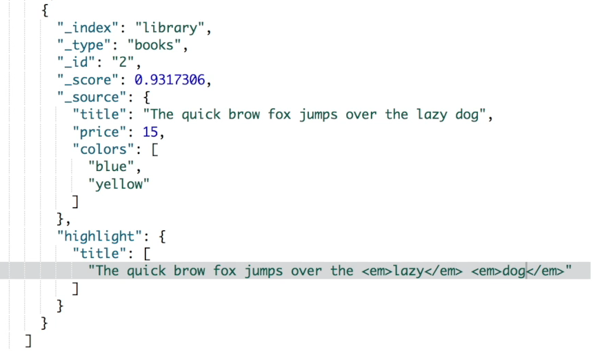

   다음과 같이 "quick" 과 "dog" 를 강조한다.

6. **filter** : 검색 결과의 sub-set 도출 score를 계산하지 않고 캐싱되어 쿼리보다 대부분 빠르다.

   6.1 (bool) must + filter 사용

   ```json
   GET /library/_search
   {
       "query": {
           "bool": {
               "must": [
                   {
                     "match": {
                       "title": "dog"
                     }
                   }
               ],
               "filter": {
                   "range": {
                       "price": {
                           "gte": 5,
                           "lte": 10
                       }
                   }
               }
           }
       }
   }
   ```

   range 필터를 줘서 price 필드가 5보다 크거나 같고 10보다 작거나 같은 경우를 찾는다. 

   즉, 필터는 한번 검색 결과에 대하여 subset만 도출하는 것!!!! 그래서 쿼리보다 속도가 빠르다. 

   6. 2 스코어가 필요없는 경우

      score가 필요없는 경우는 filter만 사용하면 더 빠르게 검색 가능하다.

7. **분석** - Analysis

   7.1 Tokenizer 를 통해 문장을 검색어 텀(term)으로 쪼갬

   ```json
   GET library/_analyze
   {
       "tokenizer": "standard",
       "text": "Brown fox brown dog"
   }
   ```

   7.2 Filter(토큰필터) 를 통해 쪼개진 텀들을 가공, lowercase - 소문자로 변경, unique는 중복 term을 제거한다.

   ```json
   GET library/_analyze
   {
       "tokenizer": "standard",
       "filter": [
           "lowercase",
           "unique"
       ],
       "text": "Brown brown brown fox brown dog"
   }
   ```

   다음은 lowercase를 적용안한 경우

   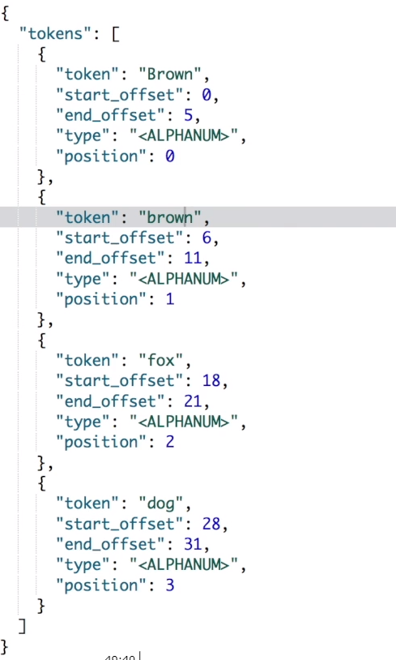

   7.3 (Tokenizer + Filter) 대신 Analyzer 사용

   ```json
   GET library/_analyze
   {
       "analyzer": "standard",
       "text": "Brown fox brown dog"
   }
   ```
