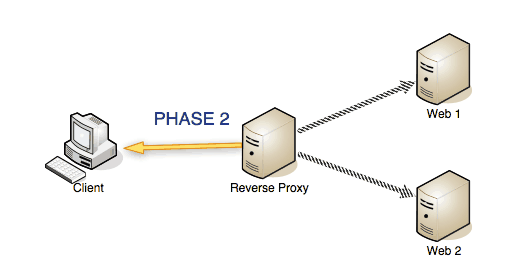

# Nginx 란

## Nginx의 개요

**트래픽이 많은 웹사이트를 위해 확장성을 위해 설계한 비동기 이벤트 기반구조의 웹서버 소프트웨어**

이 프로그램은 가벼움과 높은 성능을 목표로 만들어 졌으며, 러시아의 프로그래머 이고르 시숍브(Igor Sysoev)가 Apache의 C10K Problem(하나의 웹서버에 10,000개의 클라이언트의 접속을 동시에 다룰 수 있는 기술적인 문제)를 해결하기 위해 만든 Event-driven구조의 HTTP, Reverser Proxy, IMAP/POP PROXY server를 제공하는 오픈소스 서버 프로그램입니다. `Apache` 보다 동작이 단순하고, 전달자 역할만 하기 때문에 동시접속 처리에 특화되어 있다.

 동시접속자(약 700명) 이상이라면 서버를 증설하거나 Nginx 환경을 권한한다고 한다. 지금은 아파치가 시장 점유율이 압도적이지만, 아마존웹서비스(AWS) 상에서는 시장 점유율 44%에 달할 정도로 가볍고, 성능이 좋은 엔진이라고 한다.

현재 2019년 1월 기준 w3techs에 따르면 41.0%의 사이트들이 사용하고 있다고 합니다.([해당링크](https://w3techs.com/technologies/details/ws-nginx/all/all))


### 1. Nginx(웹서버)의 역할

#### 1-1. 정적 파일을 처리하는 HTTP 서버로서의 역할

웹서버의 역할은 HTML, CSS, Javascript, 이미지와 같은 정보를 웹 브라우저(Chrome, explore, Opera, Firefox 등)에 전송하는 역할을 한다.

#### 1-2. 응용프로그램 서버에 요청을 보내는 리버스 프록시로서의 역할



두번째 역할은 `리버스 프록시(reverse proxy)` 인데, 한마디로 말하면 클라이언트는 가짜 서버에 요청(request)하면, 프록시 서버가 배후 서버(reverse server)로 부터 데이터를 가져오는 역할을 한다. 여기서 프록시 서버가 `Nginx`, 리버스 서버가 `응용프로그램 서버` 를 의미한다.

웹 응용프로그램 서버에 리버스 프록시(Nginx)를 두는 이유는 요청(request)에 대한 버퍼링이 있기 때문이다. 클라이언트가 직접 App 서버에 요청하는 경우, 프로세스 1개가 응답 대기 상태가 되어야만 한다. 따라서 프록시 서버를 둠으로써 요청을 `배분`하는 역할을 한다.

> *nginx.conf* 파일에서 `location` 지시어를 사용하여 요청을 배분한다. 

##### 프록시 서버?


웹 서비스를 예로 들어보자. 클라이언트(웹 브라우저)는 웹 서버에 직접 연결하는 대신에 프락시 서버에 연결해서 웹 페이지를 요청한다. 이 요청을 읽은 프락시 서버는 웹 서버에 요청을 전달하고, 응답을 받아서 클라이언트에 전송한다. 인터넷 서비스의 규모가 커지면서, 분산 시스템으로 서비스가 구성되는 경우가 많다. 프락시 서버를 이용하면 분산 시스템을 뒤에 숨기는 방식으로 시스템을 단순화 할 수 있다.

##### 리버스 프록시

리버스 프락시는 일반적인 인터넷 서비스에서 널리 사용하고 있다. 리버스 프락시는 유저의 요청을 받아서 반대편(reverse)네트워크에 있는 인터넷 서버에 전달 하는 일을 한다. 리버스 프락시 서버는 단순히 요청을 전달하기만 할 뿐으로 요청의 처리는 뒷단에 있는 웹 서버들이 맡아서 한다. 따라서 하나의 리버스 프락시 서버가 여러 웹 서버로 요청을 전달하도록 구성 할 수 있다. 예컨데 **로드 밸런서**로의 역할을 수행 할 수 있다. 실제 HAProxy, NginX, Apache 웹서버들이 가지고 있는 리버스 프락시 기능을 이용해서 소프트웨어 기반의 로드밸런싱 환경을 구축하기도 한다.

소프트웨어 기반인 만큼 전용 로드밸런서 보다는 성능이 떨어질 수 있지만, 저렴한 비용과 이에 따르는 무지막지한 확장성으로 단점을 커버하고 있다. 클라우드 환경에서 사용할 로드밸런서라면 소프트웨어로 구축하는게 거의 당연하게 여겨진다.


### 2. Apache vs Nginx

- `Apache`
  * 쓰레드 / 프로세스 기반 구조로 요청 하나당 쓰레드 하나가 처리하는 구조
  *  사용자가 많으면 많은 쓰레드 생성, 메모리 및 CPU 낭비가 심함
  *  하나의 쓰레드 : 하나의 클라이언트 라는 구조
- `Nginx`
  - 비동기 Event-Driven 기반 구조. 
  - 다수의 연결을 효과적으로 처리가능. 
  - 대부분의 코어 모듈이 Apache보다 적은 리소스로 더 빠르게 동작가능
  - 더 작은 쓰레드로 클라이언트의 요청들을 처리가능


#### Nginx의 장점

1. 보안

   앞 단의 nginx로 리버스 프록시로 사용하고 뒷단에는 WAS 를 설치하여 외부에 노출되는 인터페이스에 대해 Nginx WAS 부분만 노출 가능합니다. 익명의 사용자가 직접적인 Web Server로의 접근을 한다라고 하면 문제가 발생할 수 있기 때문에 직접적이지 않고 한 단계를 더 거침으로써 보안적인 부분을 처리할 수 있는 것입니다.

2. Backend-service 장애 대응 처리

   Backend-service에 대해 max fails, fail timeout시 백업 서버로 진입할 수 있도록 처리 가능합니다.


## 3. Nginx의 기본 구성

#### 3-1. Nginx의 기본 원리 이해

Nginx는 하나의 **master process**와 하나 이상의 **worker process**로 구성되어 있다.

* **master process** : *configuration file*을 읽고 실행하며, worker process 들을 관리한다.
* **worker process** : 유저가 요청한 request에 대한 실제 작업을 수행한다.

Nginx를 이용해서 웹 서버를 관리하는 작업은 **configuration file**을 작성하고 수정함으로써 간접적으로 이뤄진다. master process가 configuration file을 읽고 실행하기 때문이다. 그러므로 웹 서버의 동작을 설정하기 위해서는 configuration file을 수정하면 된다. 수정된 configuration file의 내역을 반영시키기 위해서는 **Nginx를 stop 하고 다시 start** 하면 된다. 

  master process에 **"nginx -s signal" 커맨드로 signal**을 보내거나 Unix가 제공하는 **kill 유틸리티를 사용하는 방법**도 가능하다. 이를 위해서는 master process를 지칭하는 process ID 값이 필요한데, /usr/local/nginx/logs 혹은 /var/run 디렉토리에 있는 nginx.pid 파일에서 확인할 수 있다.

#### 3-2. Configuration File 분석

Nginx는 **module**로 구성된다. module은 configuration file에 적힌 **directive**로 제어한다. directive에는 두 가지 종류가 있다. simple directive와 block directive가 그것이다.


### default 수정하기

`/etc/nginx/sites-available` 폴더의 `default` 에서 root를 설정할 수 있다.

```shell
server {
	listen 80 default_server;
	listen [::]:80 default_server;
 	# 여기에 root path를 설정
 	root /usr/share/nginx/html;
 	# 연결시킬 html 설정
 	index index.html index.htm index.nginx-debian.html;
 	
 	server_name _;
 	location / {
        try_files $uri $uri/ =404;
 	}
 }

```


### reference

* [Nginx 이해하기 및 기본 환경설정 세팅하기](https://whatisthenext.tistory.com/123)
* [Web-Nginx](https://ideveloper2.tistory.com/m/66)
* [Nginx의 기본 구성, Configuration file 분석, 정적 컨텐츠 처리](https://technerd.tistory.com/19)