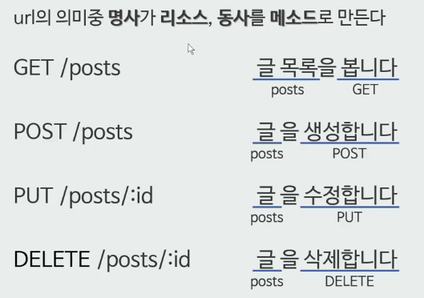
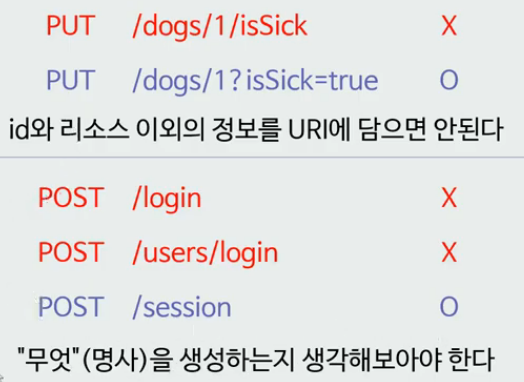

# REST API란

## REST란?

**Re**presentational **S**tate **T**ransfer

WEB (1991) 

Q. 어떻게 인터넷에서 정보를 공유할 것인가?

A: 정보들을 하이퍼텍스트로 연결한다.

* 표현 형식: HTML
* 식별자: URI
* 전송 방법: HTTP

**HTTP/1.0 (1994-1996)**

Roy T.Fielding: "How do I improve HTTP without breaking the Web?"

웹을 망가트리지 않고 HTTP를 진보시키고 싶었다.	 

그래서 HTTP Object Model을 만들게 됩니다. 이게 4년 후에 REST API로 이름이 바뀌게 됩니다.

**REST (1998)**

Roy T.Fielding, Microsoft Research에서 발표 

**REST (2000)**

Roy T. Fielding, 박사 논문으로 발표 : 이 논문이 오늘날 우리가 REST를 정의한다.


여기서 API가 있는데 이건 무엇인가?

**XML-RPC (1998)**

by Microsoft -> **SOAP** (원격으로 다른 시스템의 method를 호출할 수 있는 프로토콜을 만듦)


4년후 flickr API가 나오게 되었다. REST라는 이름으로

이게 SOAP와 비교되게 되면서 SOAP는 인기가 줄어들고 REST는 인기가 많아졌다.


그래서 WWW의 API가 REST로 정착하나 싶었는데

**CMIS (2008)** 가 나오게 되었다. 

EMC, IBM, Microsoft가 만들고, REST 바인딩을 지원하는데 

이를 본 Roy T. Fielding은 이런말을 합니다. "No REST in CMIS"


**Microsoft REST API Guidelines (2016)**

* uri는 https://{serviceRoot}/{collection}/{id} 형식이어야한다.
* GET, PUT, DELETE, POST, HEAD, PATCH, OPTIONS를 지원해야한다.
* API 버저닝은 Major.minor로 하고 uri에 버전 정보를 포함시킨다. 

> Roy T. Fielding: 이것도 REST API가 아니다. 이건 HTTP API라고 해야한다.
>
> "REST APIs must be hypertext-driven"
>
> "REST API를 위한 최고의 버저닝 전략은 버저닝을 안 하는 것"


## REST API

### REST 아키텍쳐 스타일을 따르는 API

**REST** : 분산 하이퍼미디어 시스템(예: 웹)을 위한 아키텍쳐 스타일 (제약조건의 집합)

**REST를 구성하는 스타일**

* client-server
* stateless
* cache
* **uniform interface**
* layered system
* code-on-demand (optional)

오늘늘 REST API로 불리는 건 HTTP만 따라도 대부분 만족하기 때문

이중에 uniform interface를 잘 만족을 못한다.

#### Uniform Interface의 제약조건 ( 4가지)

* identification of resources : 리소스가 uri로 식별되면 된다

* manipulation of resources through representations : representation 전송을 통해서 리소스를 조작해야한다. 리소스를 만들거나 업데이트하거나 삭제할때 http massage에 담아서 전송해야한다.

* **self-descriptive messages** 

  * 메세지는 스스로를 설명해야한다.  예를 들어 `GET / HTTP/1.1` 일때 목적지가 빠져있다. 이럴때 self-descriptive 하지 않다고 한다. 

  * 클라이언트가 이걸 해석하려고 할때 어떤 문법으로 적혀있느지 모르기 때문에 다음과 같이 Content-Type header가 추가되어야한다.

    ``` shell
    HTTP/1.1 200 OK
    Content-Type: application/json
    [{ "op": "remove", "path": "/a/b/c" } ]
    ```

  * 여기서 OP, path가 무엇인지 모르기 때문에 다음과 같이 작성해야한다.  json 명세를 찾아가서 이해해야 한다.

    ```shell
    HTTP/1.1 200 OK
    Content-Type: application/json-patch+json
    [{ "op": "remove", "path": "/a/b/c" } ]
    ```

  * 즉 *self-descriptive messages*라고 하면 메세지를 보면 메세지 만으로 온전히 이해할 수 있어야한다.

* **hypermedia as the engine of application state (HATEOAS)**

  * 애플리케이션의 상태는 Hyperlink를 이용해 전이되어야한다.
    ex) GET /articles (글 목록 보기) GET /new-form (글 쓰기) 
    상태에 있는 링크를 따라서 상태가 전이되는 것
    html에서 a tag를 통해서 전이된다.
    json에서는 Link 헤더를 통한다.

#### 왜 Uniform Interface?

* 독립적 진화
  * 서버와 클라이언트가 각각 독립적으로 진화한다.
  * 서버의 기능이 변경되어도 클라이언트를 업데이트할 필요가 없다.
  * REST를 만들게 된 계기: "How do I improve HTTP without breaking the Web."

#### 웹 (REST를 잘 만족하고 있다.)

* 웹 페이지를 변경했다고 웹 브라우저를 업데이트할 필요는 없다.
* 웹 브라우저를 업데이트했다고 웹 페이지를 변경할 필요도 없다.
* HTTP 명세가 변경되어도 웹은 잘 동작한다.
* HTML 명세가 변경되어도 웹은 잘 동작한다.


네트워크 아키텍쳐 원리모음

**REST 아키텍쳐의 6가지 제한 조건**

* 클라이언트/서버 구조
* 무상태 (Stateless)
* 캐시 처리 가능 (Cacheable)
* 계층화 (Layered System)
* Code on demand (optional)
* 인터페이스 일관성

HTTP에는 이미 위의 REST 원칙이 녹아 들어 있다.

따라서 우리는 Route에만 신경 쓰면 REST하게 사이트를 만들 수 있다.

**REST하게 만든다.** => URL 주소만 보고도 수행하려는 동작을 눈치챌 수 있게 만드는 것

## Restful API의 예시



## 어떤게 RESTful?

*주의해야할 용례*




### reference

* https://www.youtube.com/watch?v=ETdbm5jDDsg
* [Day1, 2-2. 그런 REST API로 괜찮은가](https://www.youtube.com/watch?v=RP_f5dMoHFc)