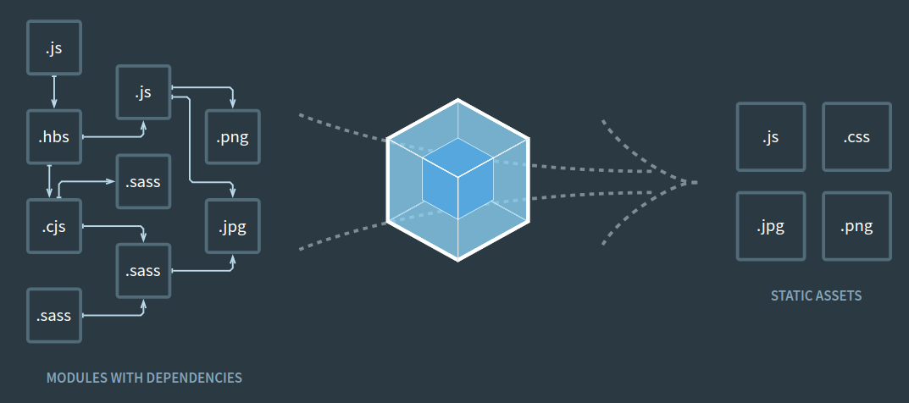

# React.js

**We built React to Solve one problem:
builing large applications with data that changes over time.**


> **프론트엔드 라이브러리** 란
>
> Angular: 프레임워크. 다양한 기능이 내장되어있다. 만들어진지 오래되었다. 타입스크립트 사용이 기본이다.
>
> React: Component에 집중되어있는 라이브러리이다. 우리가 만든 인터페이스를 조립하여 보여준다. 앵귤러와 달리 사용자에게 전달되는 뷰만 신경쓰고 나머지는 Third party library들(redux, react router)을 활용한다.
>
> Vue: 입문자가 사용하기 쉽고, Web pack같은 모듈 번들러가 없어도 그냥 cdn으로 불러와서 사용한다.  html을 template처럼 그대로 사용할 수 있어서 디자이너나 퍼블러셔가 있다면 작업속도가 빠르다. 공식 라우터와 공식 상태관리 라이브러리가 존재한다. JSX를 사용할 수 있다.


## 특징

공식 사이트에서는 특징을 크게 세 가지로 나눠 소개하고 있습니다.

### (1) JUST THE UI

React.js는 UI 컴포넌트를 만들기 위한 **라이브러리**입니다. MVC(Model View Controller) 패턴에서 V (View) 에만 집중하고 있는 점이 특징입니다. 


리액트는 *커스텀 태그*를 지원하고 있습니다. 커스텀 태그란 `<h1>` 처럼 미리 지정된 태그 외에 나만의 태그를 만들어 웹을 개발하는 방식입니다. 커스텀 태그는 각 기능을 모듈화하고 향후 전체 코드를 쉽게 이해할 수 있게 돕고, 개발자는 소스코드 수정과 재활용도 편히 할 수 있습니다. 


### (2) VIRTUAL DOM

React.js는 자바스크립트 내에 DOM Tree와 같은 구조체를 virtual DOM으로 갖고 있습니다. 다시 그릴 때는 그 구조체의 전후 상태를 비교하여 변경이 필요한 최소한의 요소만 실제 DOM에 반영합니다. 따라서 무작위로 다시 그려도 변경에 필요한 최소한의 DOM만 갱신되기 때문에 빠르게 처리할 수 있습니다.

리액트는 메모리 상에 DOM을 구성하고, 가상 DOM으로 변경된 부분만 업데이트해 속도를 향상 시킵니다. 개발자가 사용자 인터페이스를 개발할 때 자주 부딪치는 문제가 성능과 테스트입니다. 가상 DOM 기술을 사용하면 비록 완벽하지는 않겠지만 이 두 가지 문제를 더 쉽게 해결할 수 있습니다. 

### (3) DATA FLOW

React.js는 단방향 데이터를 지향합니다. 따라서 Angular.js의 양방향 데이터 바인딩을 사용할 때처럼 작성할 코드의 양이 확연히 줄거나 하지는 않습니다. 그렇지만, 어플리케이션의 데이터를 관리하는 모델 컴포넌트가 있고 그 데이터를 UI 컴포넌트에 전달하는 단순한 데이터 흐름으로 이해하고 관리하기 쉬운 어플리케이션을 만들 수 있습니다.

Data가 한쪽 방향으로만 흐르고 변하는 시점이 명시적이기에 데이터가 언제 어떻게 바뀌는지 고민할 필요가 없습니다.


## LifeCycle


## JSX

JSX는 React를 위해 태어난 새로운 자바스크립트 문법으로, 과거 페이스북이 만들었던 PHP의 개량판 XHP에 그 기원을 두고 있습니다. (참조)[React.js Conf 2015 Keynote](https://www.youtube.com/watch?v=KVZ-P-ZI6W4)

```
class HelloMessage extends React.Component {
  render() {
    return <div>Hello {this.props.name}</div>;
  }
}
ReactDOM.render(<HelloMessage name="John" />, mountNode)
```

이 코드는 “Hello, John”라는 div를 생성하는 컴포넌트입니다. ES6를 공부하신 분들이라면, class를 이용한 method 상속 패턴 자체에는 익숙하실 겁니다. 그러나 아마 React를 처음 접하신 분들에게는 낯선 곳이 두군데 있습니다. 바로 render 함수의 return 값과 ReactDOM.render함수의 첫번째 argument죠. 뭔가 html처럼 보이긴 하는데 스트링으로 감싸진 것도 아닌 정체불명의 녀석들입니다.

React는 작성한 코드를 컴파일하는 과정을 꼭 거쳐야 합니다. 대부분 사실상 자바스크립트 표준이 되어가고 있는 Babel을 사용하죠. Babel의 React 플러그인을 통해 위의 코드를 컴파일하면 다음과 같은 모습이 됩니다.

```
class HelloMessage extends React.Component {
  render() {
    return React.createElement(
      "div",
      null,
      "Hello ",
      this.props.name
    );
  }
}

ReactDOM.render(React.createElement(HelloMessage, { name: "John" }), mountNode);
```

이제 그냥 보통 자바스크립트 코드가 되었죠? React는 `Babel`과 같은 *트랜스파일러* 를 꼭 써야하기 때문에 `Webpack` 등을 통한 꽤 까다로운 초기 세팅이 필수적입니다. 그렇다면 왜 굳이 이런 번거로움을 들여가며, JSX를 사용하는 것일까요?

물론 JSX를 사용하지 않고 바로 위의 코드처럼 직접 순수한 자바스크립트 코드를 작성하여 React를 사용할 수도 있습니다. 그러나 실제로 그렇게 사용하는 경우는 거의 없을 뿐 아니라, React를 사용하는 중요한 이유 중 하나를 포기하는 셈이 되죠.

JSX는 보통 선언적이라고 번역되는, Declarative한 개발을 도와주는 도구입니다. 간단하게 말해 한눈에 이해하기 쉬운 개발을 만들어 줍니다. JSX는 그 형태가 마치 html과 같습니다. 유저에게 보여주고 싶은 최종적인 View라고 할 수 있죠. 개발자는 JSX를 통해 결과물에 직관적으로 도달할 수 있습니다. 이는 예측가능한 개발을 만들어줄 뿐 아니라 유지보수, 협업 등에서도 엄청난 강점을 발휘합니다.

## Webpack

**웹 어플리케이션을 개발할때 전체적으로 파일들을 관리해주는 도구**

웹팩은 코드를 의존하는 순서대로 합쳐서 하나또는 여러개의 파일로 만들어낸다. 만약 js파일에서 png파일을 사용하겠다고 import를 하게되면 bundling작업을 하게될 때 특정 확장자마다 어떠한 처리 작업을 하도록 준비해주는 것이다. 나중에 어떤 html을 사용할때 자동으로 가지고 와서 사용할 수 있다.  



## Babel

**자바스크립트 변환 도구**

자바스크립트 V8엔진에서 모든 문법을 지원하지는 않는다. 따라서 babel을 통하여 ES5로 변환시킨다.

`next-gen JavaScript`

```javascript
var [a,,b] = [1,2,3];
```

`browser-compatible JavaScript`

```javascript
var _ref = [1,2,3],
	a = _ref[0],
	b = _ref[1];
```


## Component 생성하는 방법

### (1) Class

```javascript
import React, {Component} form 'react'

class App extends Component {
    render() {
        return (
            <div>
            	Hello
            </div>
        )
    }
}
export default App;
```

### (2) 함수형 컴포넌트

초기 mount 속도가 미세하게 더 빠르다. 그리고 불필요한 기능이 없어 메모리도 적게 사용된다. 

```javascript
import React from 'react';

const MyName = ({ name }) => {
    return (
        <div>
        	Hello! {name}
        </div>
    )
}
export default MyName;
```

### 화살표함수

React에서 화살표함수를 많이 사용하게 되는데, 만약에 화살표함수를 사용하지 않는다면 this가 무엇인지 모르게된다. 따라서 constructor를 만들어 component가 가지고 있는 생성 함수를  호출해주어야한다. 또한 handleDecrease에서 사용하는 this가 constructor에서 사용하는 this라는 것을 명시해줘야한다.

```javascript
import React, {Component} form 'react'

class Counter extends Component {
    state = {
        number: 0
    };
    constructor(props) {
        super(props);
        this.handleDecrease = this.handleDecrease.bind(this);
    }
	handleDecrease(){
        this.setState({
            number: this.state.number - 1
        })
	}
//화살표함수
    handleIncrease = () => {
        this.setState({
            number: this.state.number + 1
        });
    }
    render() {
        return (
            <div>
            	Hello
            </div>
        )
    }
}
export default Counter;
```


###  reference

* [React.js를 이해하다](https://blog.coderifleman.com/2015/06/23/learning-react-1/)
* [페이스북의 인기 오픈소스 기술, ‘리액트’란?](http://www.bloter.net/archives/233564)
* [React의 탄생배경과 특징](https://medium.com/@RianCommunity/react%EC%9D%98-%ED%83%84%EC%83%9D%EB%B0%B0%EA%B2%BD%EA%B3%BC-%ED%8A%B9%EC%A7%95-4190d47a28f)
* [유튜브 Velopert](https://www.youtube.com/watch?v=_aBq1SKl6yQ&index=2&list=PL9FpF_z-xR_E4rxYMMZx5cOpwaiwCzWUH)
* [React의 기본, 컴포넌트를 알아보자](https://medium.com/little-big-programming/react%EC%9D%98-%EA%B8%B0%EB%B3%B8-%EC%BB%B4%ED%8F%AC%EB%84%8C%ED%8A%B8%EB%A5%BC-%EC%95%8C%EC%95%84%EB%B3%B4%EC%9E%90-92c923011818)
* [[번역] React ES6 — Class constructor에서의 super()](https://medium.com/@umioh1109/react-es6-class-constructor%EC%97%90%EC%84%9C%EC%9D%98-super-9d53ba0611d9)

