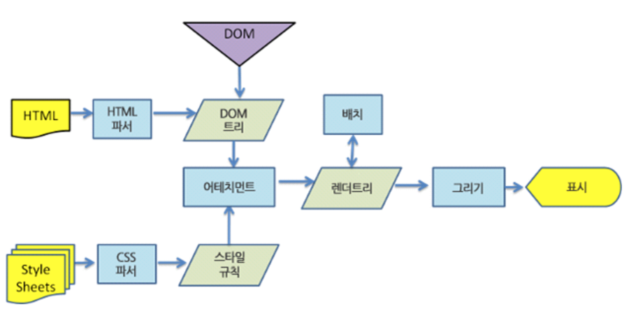

# Virtual DOM

> Virtual DOM 은 React 뿐 아니라 Vue.js 2.0에서도 사용된다.

## Overview

Virtual DOM 기술은 DOM 조작에 있어 비효율적인 이유에서 나오게 되었다.

기존에는 아래와 같이, JavaScript 또는 Jquery를 통해 원하는 dom 노드를 찾은 후 변경하는 행위를 했다.

```javascript
document.getElementById('myId').appendChild(myNewNode)
```

하지만 수천가지의 노드가 존재할 수 있기에, 계산하기 위해 큰 비용을 투자하게 된다.

그 결과, 성능 저하로 인한 페이지 속도 지연이 발생한다.

위와 같은 처리에 대한 비용이 큰 자세한 이유는 링크를 참고하길 바란다. [브라우저는 어떻게 동작하는가?](http://d2.naver.com/helloworld/59361)

간단히 설명하자면, 아래의 그림과 같은 동작이 DOM 조작을 할 때마다 영향을 끼치게 되는 것이다.



이러한 배경 속에서 Virtual DOM이 탄생하게 되었다.

이러한 Virtual DOM에 대해 코드를 통해 표현할 수 있다.

```html
<ul id='myId'>
	<li>Item 1</li>
	<li>Item 2</li>
</ul>
```

위와 같은 HTML 코드가 있는 상태에서 id가 'myId' ul 태그 안에 li 태그 하나를 추가할 것이다.

이 작업을 위해 우리는 기존 방법으로는 javascript, jquery를 통해 노드를 찾은 후 필요한 노드를 삽입했다.

```javascript
let domNode = {
    tag: 'ul'
    attributes: { id: 'myId' }
    children: [
		//where the LI's would go
    ]
};
```

domNode 객체를 Virtual DOM으로 보면 된다.

직접 DOM API를 사용하지 않고, domNode 객체를 활용하게 된다.

이러한 처리는 실제 DOM이 아닌 메모리에 있기 때문에 훨씬 더 빠르다.

```javascript
domNode.children.push('<li>Item 3</li>');
```

즉, 실제 DOM이 아닌 Virtual DOM에 먼저 변경 작업을 해준다. 그리고 변경된 부분만 찾아 실제 DOM에 변경해주는 방식이다. 이로써, 기존 View 방식보다 많은 양의 연산을 줄일 수 있게 된다.


### reference

* [리액트에 대해서 그 누구도 제대로 설명하기 어려운 것-왜 Virtual DOM인가?](https://velopert.com/3236)
* [가상 돔과 돔의 차이점](http://webframeworks.kr/tutorials/translate/virtual-dom/)
* [Virtual DOM이란 무엇인가?::마이구미](http://mygumi.tistory.com/190)