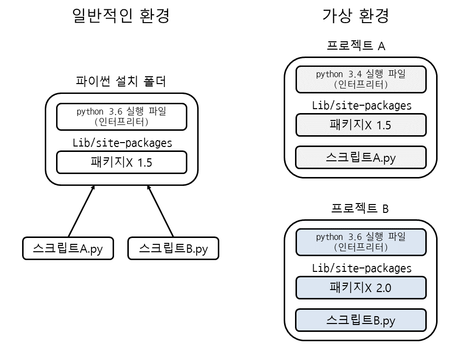

# python 가상환경 사용하는 이유

 python을 사용하다 보면 pip로 패키지를 설치하게 되는데 이 패키지들은 파이썬 설치 폴더의 Lib/site-packages 안에 저장됩니다. 

그래서 pip로 설치한 패키지는 모든 파이썬 스크립트에서 사용할 수 있게 됩니다. 평소에는 이런 방식이 큰 문제가 없지만 프로젝트 여러 개를 개발할 때는 패키지의 버전 문제가 발생합니다.

예를 들어 프로젝트 A에서는 패키지X 1.5를 사용해야 하고, 프로젝트 B에서는 패키지X 2.0을 사용해야 하는 경우가 생깁니다. 이 패키지X 1.5와 2.0은 호환이 되지 않는다면 개발하기가 상당히 불편해집니다.

이런 문제를 해결하기 위해 파이썬에서는 가상 환경(virtual environment)을 제공하는데, 가상 환경은 독립된 공간을 만들어주는 기능입니다. 

가상 환경에서 pip로 패키지를 설치하면 가상 환경 폴더(디렉터리)의 Lib/site-packages 안에 패키지를 저장해줍니다. 

즉, 프로젝트 A와 B 각각 가상 환경을 만들어서 프로젝트 A에는 패키지X 1.5를 설치하고, 프로젝트 B에는 패키지X 2.0을 설치합니다. 

이렇게 하면 파이썬 스크립트를 실행할 때도 현재 가상 환경에 설치된 패키지를 사용하므로 버전 문제가 발생하지 않습니다.



특히 가상 환경에는 파이썬 실행 파일(인터프리터) 자체도 포함되므로 각 가상 환경 별로 다른 버전의 파이썬 인터프리터가 들어갈 수 있습니다. 즉, 스크립트를 실행할 때는 원래 설치된 파이썬 인터프리터가 아닌 가상 환경 안의 파이썬 인터프리터를 사용합니다.

그럼 가상 환경을 만드는 방법을 알아보겠습니다. 가상 환경은 venv 모듈에 가상 환경 이름을 지정해서 만듭니다.

venv는 파이썬 3.3이상부터 사용 가능

```shell
python -m venv 가상환경이름
```

여기서는 C:₩project 폴더 아래에 가상 환경을 만들겠습니다. 

다음과 같이 명령 프롬프트에서 example 가상 환경을 만들고 example 폴더 안으로 이동합니다. 

그다음에 Scripts 폴더 안의 activate.bat 파일을 실행하면 가상 환경이 활성화됩니다.

```shell
PS C:₩project> python -m venv example
PS C:₩project> cd example
PS C:₩project₩example> .₩Scripts₩Activate.ps1
(example) PS C:₩project₩example>
```

프롬프트 앞을 보면 (example)과 같이 가상 환경 이름이 표시됩니다. 

이 상태에서 pip로 패키지를 설치하면 C:₩project₩example₩Lib₩site-packages 안에 패키지가 저장됩니다. 

또한, 이 상태에서 스크립트 파일을 실행하면 현재 가상 환경 안에 있는 파이썬 인터프리터와 패키지를 사용합니다.


### reference

+ https://dojang.io/mod/page/view.php?id=1168